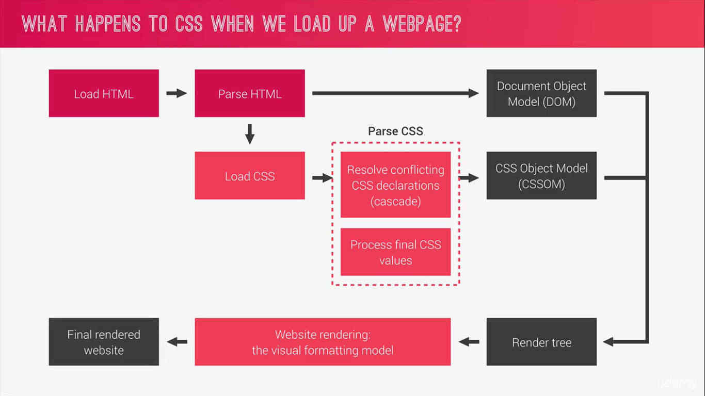

# Advanced CSS and SASS

## Chapter 3 - How CSS Works

### Three pillars to write good HTML/CSS 
    
    - Responsive design
      - Fluid Layouts
      - Media Queries
      - Responsive Images
      - Correct units
      - Desktop first vs. Mobile first

    - Maintainable & Scalable code
      - Clean
      - Easy to understand
      - Growth
      - Reusable
      - How to organize files
      - How to name classes

    - Web performance
      - Less HTTP requests
      - Less images
      - Compress images
      - Less code
      - Compress code
      - Use a CSS Preprocessor

### What happens when you load a webpage on a browser
- 
- 

- **Cascade**: Process of combining different stylesheets and resolving conflicts between different  CSS rules and declarations when more than one rule applies to a certain element.

### Cascades
- CSS could come from three sources
  - Author
  - User
  - Browser (user-agent)

- 
- Computing specificity
  - 
  - Universal selector * has specificity (0, 0, 0, 0)
  - Rely on specificity rather than order of the code
  - When using external stylesheets, always put your author stylesheets last
  - pseudo classes count as a class
  - If you intent to use :hover, ensure that the selector with the :hover has higher specificity than the one without the :hover

### How CSS values are processed
- Percent value is not a unit like `rem`, `em` so does not get processed in the "Computed" stage
- Even undeclared properties need to have a value eg. padding in the following example
- 
- 
- 

### How units are converted from relative to absolute
- `percentages`
  - `font` - use parent's computed `font-size` as reference
  - `length` - use parent's computed `width` as reference

- `em`s 
  - `font` - use parent's computed `font-size` as reference
  - `lengths` - use current element's computed `font-size` as reference

- `rem`s always use the root font size as reference
- 

### Things to remember
- Each property has an initial value, used if nothing is declared and if there is no inheritance
- Browsers specify a root font-size for each page, usually 16px
- Percentages and relative values are always converted to pixels

### Inheritance
- Passes some specific properties from parents to children
- Properties related to text are inherited
- Computed value (eg. 24px) is what gets inherited, not declared value (eg. 150%)
- 
- `inherit` keyword forces inheritance on a property
- `initial` keyword forces resets a property to its initial value

### Visual formatting model

- **Definition**: Algorithm that calculates the boxes and determines the layout of the boxes for each element in the render tree in order to determine the final layout of the page

- This includes
  - **Dimensions of the boxes**
  - **Box type**: inline, block etc.
  - **Positioning scheme**: floats, positioning
  - **Stacking contexts**
  - Other elements in the render tree (children, siblings)
  - Viewport size, dimensions of images

- Box Model
  - 
  - total width = left border + left padding + width + right padding + right border
  - total height = top border + top padding + width + bottom padding + bottom border
  - 
  - 
  - 
  - Stacking context: the following affect the stacking context
    - `z-index`
    - `opacity` value different from 1
    - `transform`
    - `filters`
    - Because of these, stacking order may not work as expected

### Think - Build - Architect mindset
- **Think** about the layout of web app before writing code
  - Component driven design: modular building blocks
  - Held together by the layout of the page
  - Reusable across a project and between different projects
  - Independent, allowing us to use them anywhere on the page

- **Build** your layout in HTML and CSS with a consistent naming scheme
  - BEM naming scheme: `block__element--modifier`
  - **Block** - standalone components that can be reused. Could be nested inside one another
  - **Element** - part of a block that has no meaning of its own `info`, `stats-box`
  - **Modifier** - A different version of a block or an element
 
- Create a logical **architecture** for your CSS with files and folders
  - 7-1 pattern
    - 7 different folders for partial Sass files and 1 main Sass file to import all other files into a compiled CSS stylesheet
      - `base/`
      - `components/`
      - `layout/`
      - `pages/`
      - `themes/`
      - `abstracts/` (variables/mixins)
      - `vendors/`
    - You don't need to use all 7 folders- it depends on the size of your project
    - 