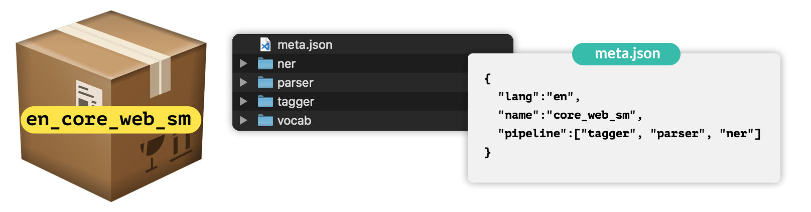

# Advanced NLP with spaCy

# Chapter 1

## Introduction to spaCy

### The nlp object
```python
  from spacy.lang.en import English
  nlp = English()
  ```
- variable containing the processing pipeline
- includes language specific rules for tokenization etc. (@niazangels: what do you mean "etc")

### The Doc object
- When you process a text with the nlp object, spaCy creates a Doc object – short for "document". 
- The Doc lets you access information about the text in a structured way, and **no information is lost**.
- The Doc behaves like a normal Python sequence and lets you iterate over its tokens

### The Token object
- `Token` objects represent the tokens in a document – for example, a word or a punctuation character.
- Token objects provide various attributes containing information about the tokens.

### The Span object
- A `Span` object is a slice of the document consisting of one or more tokens. It's only a view of the `Doc` and doesn't contain any data itself.
- Slicing a `Doc` will return a `Span`

### Lexical attributes
- refer to the entry in the vocabulary and don't depend on the token's context
- `is_alpha`, `is_digit`, `is_punct`, `like_num`


## Statistical Models

- Enable spaCy to predict linguistic attributes in context
    - Part-of-speech tags
    - Syntactic dependencies
    - Named entities
- **Trained on labeled example texts**
- Can be updated with more examples to fine-tune predictions

### Model packages
`$ python -m spacy download en_core_web_sm`

```python
import spacy
nlp = spacy.load("en_core_web_sm")
```

- Binary weights that enable spaCy to make predictions.
- Vocabulary (@niazangels: How did `English()` tokenize without models? With rules?)
- Meta information (which language class to use and how to configure the processing pipeline)
- The `spacy.load` method loads a model package by name and returns an nlp object.


### Part of Speech
```python
for token in doc:
    print(token.text, token.pos_)
```
- **Attributes that return strings usually end with an underscore** – attributes without the underscore return an integer ID value.

### Predicting Syntactic Dependencies
```python
for token in doc:
    print(token.text, token.pos_, token.dep_, token.head.text)
```

- The `.dep_` attribute returns the predicted dependency label.

- The `.head` attribute returns the syntactic head token (parent token this word is attached to).

### Dependencies Label Scheme
- To describe syntactic dependencies, spaCy uses a standardized label scheme. Here's an example of some common labels:

  

### Predicting Named Entities
```python
for ent in doc.ents:
    print(ent.text, ent.label_)
```
- Tip: Use `spacy.explain("GPE")` to get expansions

## Rule based matching

### Why not just regular expressions
- Match on `Doc` objects, not just strings
- Match on tokens and token attributes
- Use the model's predictions
- Example: "duck" (verb) vs. "duck" (noun)

### Match patterns


- Lists of dictionaries, one per token
-  The keys are the names of token attributes, mapped to their expected values.

- Match exact token texts

        `[{"TEXT": "iPhone"}, {"TEXT": "X"}]`

- Match lexical attributes

        `[{"LOWER": "iphone"}, {"LOWER": "x"}]`

- Match any token attributes

        `[{"LEMMA": "buy"}, {"POS": "NOUN"}]`


### Using Matcher

```python
import spacy
from spacy.matcher import Matcher

nlp = spacy.load("en")
matcher = Matcher(nlp.vocab)

pattern = [{"TEXT": "iPhone"}, {"TEXT":"X"}]
matcher.add("IPHONE_PATTERN", None, pattern)

doc = nlp("Upcoming iPhone X release date leaked")
matches = matcher(doc)
```

- The matcher is initialized with the shared vocabulary, `nlp.vocab`
- The matcher.add method lets you add a pattern. 
  - first arg is a unique pattern ID. 
  - second arg is an optional callback.
  - third arg is the pattern.

```python
for match_id, start, end in matches:
    matched_span = doc[start:end]
    print(matched_span.text)
```

- **match_id**: hash value of the pattern name
- **start**: start tok index of matched span
- **end**: end tok index of matched span

```python
pattern = [ {"LEMMA": "love", "POS": "VERB"},
            {"POS": "NOUN"}]

doc = nlp("I loved dogs but now I love cats more.")
```

### Operators and Quantifiers

  

```python
pattern = [
    {"LEMMA": "buy"},
    {"POS": "DET", "OP": "?"},  # optional: match 0 or 1 times
    {"POS": "NOUN"}
]

doc = nlp("I [ bought a smartphone ]. Now I'm [ buying apps ] .")
```

# Chapter 2: Large-scale data analytics with spaCy

## Data Structures

### Shared vocab and string store
- `Vocab`: stores data shared across multiple documents
- To save memory, spaCy encodes all strings to hash values
- Strings are only stored once in the StringStore via nlp.vocab.strings
- String store: lookup table in both directions

```python
coffee_hash = nlp.vocab.strings["coffee"]
coffee_string = nlp.vocab.strings[coffee_hash]
```

### Lexemes: entries in vocabulary
```py
doc = nlp("I love coffee")
lexeme = nlp.vocab["coffee"]

print(lexeme.text, lexeme.orth, lexeme.is_alpha)
# coffee 3197928453018144401 True
```
- A `Lexeme` object is an entry in the vocabulary
- Contains the context-independent information about a word
  - Word text: lexeme.text and lexeme.orth (the hash
  - Lexical attributes like lexeme.is_alpha
  - Not context-dependent part-of-speech tags, dependencies or entity labels

  

### The Doc object

```py
words = ["Hello", "world", "!"]
spaces = [True, False, False]

doc = Doc(nlp.vocab, words=words, spaces=spaces)
```

### The Span object

  

- The `Span` takes at least three arguments: the doc it refers to, and the start and end index of the span.

```py
span = Span(doc, 0, 2)

# Create a span with a label
span_with_label = Span(doc, 0, 2, label="GREETING")

# Overwrite the doc.ents with a list of Spans
doc.ents = [span_with_label]
```

### Best practices
- The Doc and Span are very powerful and optimized for performance. 
- They give you access to all references and relationships of the words and sentences.
  - **Convert result to strings as late as possible**. If you do it too early, you'll lose all relationships between the tokens.
  - Use token attributes if available – for example, `token.i` for the token index
- Don't forget to pass in the shared `vocab`

## Word vectors and semantic similarity

- spaCy can compare two objects and predict similarity
`Doc.similarity()`, `Span.similarity()` and `Token.similarity()`
- Take another object and return a similarity score (0 to 1)
- Important: needs a model that has word vectors included, for example:
    - ✅ en_core_web_md (medium model)
    - ✅ en_core_web_lg (large model)
    - 🚫 NOT en_core_web_sm (small model)

- Similarity is determined using word vectors
  - Generated using an algorithm like Word2Vec and lots of text
- Can be added to spaCy's statistical models 
  - Default: cosine similarity, but can be adjusted
- Doc and Span vectors default to **average of token vectors**
- **Short phrases are better than long documents** with many irrelevant words

- Similarity depends on the application context
- Useful for many applications: recommendation systems, flagging duplicates etc.
- There's no objective definition of "similarity"
- Depends on the context and what application needs to do
- `en_core_web_md` which includes around 20.000 word vectors

```py
doc1 = nlp("I like fast food")
doc2 = nlp("I like pizza")
print(doc1.similarity(doc2))
```

```py
token1 = doc[2]
token2 = doc[4]
print(token1.similarity(token2))
```

```py
doc = nlp("I like pizza")
token = nlp("soap")[0]

print(doc.similarity(token))
```
```py
span = nlp("I like pizza and pasta")[2:5]
doc = nlp("McDonalds sells burgers")

print(span.similarity(doc))
```
### Word vectors 

```py
# 300 dimensional vector
print(doc[3].vector)
```

## Combining models and rules
  

- Detecting product or person names usually benefits from a statistical model.
- Rule-based approaches on the other hand come in handy if there's a more or less finite number of instances you want to find. For example, **all countries or cities of the world, drug names or even dog breeds**

### Adding statistical predictions
```py
doc = nlp("I have a Golden Retriever")

matcher = Matcher(nlp.vocab)
matcher.add("DOG", None, [{"LOWER": "golden"}, {"LOWER": "retriever"}])

for match_id, start, end in matcher(doc):
    span = doc[start:end]
    print("Matched span:", span.text)
    print("Root head token:", span.root.head.text)
```

### Efficient phrase matching

- PhraseMatcher like regular expressions or keyword search – but with access to the tokens!
- Takes Doc object as patterns
- More efficient and faster than the Matcher
- Great for matching large word lists

```py
from spacy.matcher import PhraseMatcher

matcher = PhraseMatcher(nlp.vocab)

doc = nlp("I have a Golden Retriever")

pattern = nlp("Golden Retriever")
matcher.add("DOG", None, pattern)

for match_id, start, end in matcher(doc):
    span = doc[start:end]
    print("Matched span:", span.text)
```

### Matching from a list of finite items

```py
import json

from spacy.lang.en import English
from spacy.matcher import PhraseMatcher


nlp = English()
doc = nlp("Czech Republic may help Slovakia protect its airspace")

with open("exercises/en/countries.json") as f:
    COUNTRIES = json.loads(f.read())

matcher = PhraseMatcher(nlp.vocab)

patterns = list(nlp.pipe(COUNTRIES))
matcher.add("COUNTRY", None, *patterns)

matches = matcher(doc)
print([doc[start:end] for match_id, start, end in matches])
```

# Chapter 3 - Processing Pipelines

## Processing Pipelines

### What happens when you call nlp?

  

- First, the tokenizer is applied to turn the string of text into a `Doc` object. 
- Next, a series of pipeline components is applied to the doc in order. In this case, the tagger, then the parser, then the entity recognizer. 
- Finally, the processed doc is returned.

### Built in Pipeline
  

- The part-of-speech tagger sets the token.tag and token.pos attributes.

- The dependency parser adds the token.dep and token.head attributes and is also responsible for detecting sentences and base noun phrases, also known as noun chunks.

- The named entity recognizer adds the detected entities to the doc.ents property. It also sets entity type attributes on the tokens that indicate if a token is part of an entity or not.

- Finally, the text classifier sets category labels that apply to the whole text, and adds them to the doc.cats property.

### Under the hood
  

- Pipeline defined in model's meta.json in order
- Built-in components need binary data to make predictions

### Pipeline attributes
- `nlp.pipe_names`: list of pipeline component names
- `nlp.pipeline`: list of (name, component) tuples 

## Custom Pipeline components
- Make a function execute automatically when you call nlp
- Add your own metadata to documents and tokens
- Updating built-in attributes like doc.ents

### Anatomy of a component
- Function that takes a doc, modifies it and returns it
- Can be added using the nlp.add_pipe method

```py
def custom_component(doc):
    # Do something to the doc here
    return doc

nlp.add_pipe(custom_component)
```

  


### Complex components

```py
import spacy
from spacy.tokens import Span
from spacy.matcher import PhraseMatcher

nlp = spacy.load("en_core_web_sm")

animals = ["Golden Retriever", "cat", "turtle"]
animal_patterns = list(nlp.pipe(animals))

matcher = PhraseMatcher(nlp.vocab)
matcher.add("ANIMAL", None, *animal_patterns)

def animal_component(doc):
    matches = matcher(doc)
    spans = [Span(doc, start, end, label="ANIMAL") for match_id, start, end in matches]
    doc.ents = spans
    return doc

nlp.add_pipe(animal_component, after="ner")

doc = nlp("I have a cat and a Golden Retriever")
print([(ent.text, ent.label_) for ent in doc.ents])
```
## Extension attributes
### Setting custom attributes
- Add custom metadata to documents, tokens and spans
- Registered on the global `Doc`, `Token` or `Span` using the `set_extension` method
- Accessible via the `._` property. This makes it clear that they were added by the user, and not built into spaCy, like `token.text`.

```py
Doc.set_extension("title", default=None)
Token.set_extension("is_color", default=False)
Span.set_extension("has_color", default=False)

doc._.title = "My document"
token._.is_color = True
span._.has_color = False
```

- There are three types of extensions: 
  - attribute extensions
  - property extensions
  - method extensions

```py
from spacy.tokens import Token

Token.set_extension("is_color", default=False)

doc = nlp("The sky is blue.")
doc[3]._.is_color = True
```

### Property extension
- Define a getter and an optional setter function
- Getter only called when you retrieve the attribute value
  - This lets you compute the value dynamically, and even take other custom attributes into account.

```py
from spacy.tokens import Token

def get_is_color(token):
    colors = ["red", "yellow", "blue"]
    return token.text in colors

Token.set_extension("is_color", getter=get_is_color)

doc = nlp("The sky is blue.")
print(doc[3]._.is_color, "-", doc[3].text)
```

- `Span` extensions should almost always use a getter.
  - Otherwise, you'd have to update every possible span ever by hand to set all the values

```py
from spacy.tokens import Span

def get_has_color(span):
    colors = ["red", "yellow", "blue"]
    return any(token.text in colors for token in span)

Span.set_extension("has_color", getter=get_has_color)

doc = nlp("The sky is blue.")

print(doc[1:4]._.has_color, "-", doc[1:4].text)
print(doc[0:2]._.has_color, "-", doc[0:2].text)
```

### Method extensions
- Assign a function that becomes available as an object method
- Lets you pass one or more arguments to it, and compute attribute values dynamically.

```py
def has_token(doc, token_text):
    in_doc = token_text in [token.text for token in doc]
    return in_doc

Doc.set_extension("has_token", method=has_token)

doc = nlp("The sky is blue.")

print(doc._.has_token("blue"), "- blue")
print(doc._.has_token("cloud"), "- cloud")
```

```py
def to_html(span, tag):
    return f"<{tag}>{span.text}</{tag}>"


Span.set_extension("to_html", method=to_html)

doc = nlp("Hello world, this is a sentence.")
span = doc[0:2]
print(span._.to_html("strong"))
```

```py
def get_wikipedia_url(span):
    if span.label_ in ("PERSON", "ORG", "GPE", "LOCATION"):
        entity_text = span.text.replace(" ", "_")
        return "https://en.wikipedia.org/w/index.php?search=" + entity_text

Span.set_extension("wikipedia_url" getter=get_wikipedia_url)

```

## Components with extenstions

```py
def countries_component(doc):
    matches = matcher(doc)
    doc.ents = [Span(doc, start, end, label=match_id) for match_id, start, end in matches]
    return doc


nlp.add_pipe(countries_component)

get_capital = lambda span: CAPITALS.get(span.text)
Span.set_extension("capital", getter=get_capital)

doc = nlp("Czech Republic may help Slovakia protect its airspace")
print([(ent.text, ent.label_, ent._.capital) for ent in doc.ents])
```

## Scaling and performance
### Process large volumes of text

- Use nlp.pipe method
- Processes texts as a stream, yields Doc objects
- Much faster than calling nlp on each text because it batches up the texts.
- BAD
  - `docs = [nlp(text) for text in LOTS_OF_TEXTS]`
- BETTER
  - `docs = list(nlp.pipe(LOTS_OF_TEXTS))`

```py
for doc in nlp.pipe(TEXTS):
    print([token.text for token in doc if token.pos_ == "ADJ"])
```

### Passing in context

- `nlp.pipe` also supports passing in tuples of text / context if you set `as_tuples` to `True`.
- The method will then yield `(doc, context)` tuples.
- This is useful for passing in additional metadata, like an ID associated with the text, or a page number.

```py
data = [
    ("This is a text", {"id": 1, "page_number": 15}),
    ("And another text", {"id": 2, "page_number": 16}),
]

for doc, context in nlp.pipe(data, as_tuples=True):
    print(doc.text, context["page_number"])
```

Or you can add it to a custom attribute

```py

Doc.set_extension("id", default=None)
Doc.set_extension("page_number", default=None)

data = [
    ("This is a text", {"id": 1, "page_number": 15}),
    ("And another text", {"id": 2, "page_number": 16}),
]

for doc, context in nlp.pipe(data, as_tuples=True):
    doc._.id = context["id"]
    doc._.page_number = context["page_number"]
```

### Use only the tokenizer
- If you only need a tokenized `Doc` object (and not the predictions), you can use the `nlp.make_doc` method instead, which takes a text and returns a doc.
- This is how spaCy does it behind the scenes
- BAD
  - `nlp("Hello World!")`
- BETTER
  - `nlp.make_doc("Hello World!")`


### Disabling pipeline components
- Use `nlp.disable_pipes` to temporarily disable one or more pipes

```py
with nlp.disable_pipes("tagger", "parser"):
    doc = nlp(text)
    print(doc.ents)
```

# Chapter 4

## Training and updating models
- The entity recognizer tags words and phrases in context
- **Entities can't overlap.** Each token can only be part of one entity
- Examples need to come with context

`("iPhone X is coming", {"entities": [(0, 8, "GADGET")]})`

- Texts with no entities are also important. In this case, the list of span annotations will be empty.


`("I need a new phone! Any tips?", {"entities": []})`

- Goal: teach the model to generalize
- Update an existing model: a few hundred to a few thousand examples
- Train a new category: a few thousand to a million examples (spaCy's English models: 2 million words)
- Usually created manually by human annotators
- Can be semi-automated – for example, using spaCy's Matcher
- 