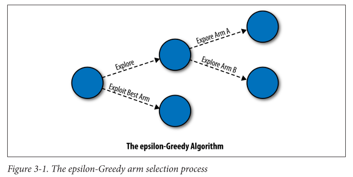

# Bandit Algorithms for Website Optimization

- Author: John Myles White
- URL: https://www.oreilly.com/library/view/bandit-algorithms-for/9781449341565/

## Chapter 2 - Why Use Multiarmed Bandit Algorithms?

Standard A/B testing consists of:
  -  A short period of pure exploration, in which you assign equal numbers of users to Groups A and B.
  -  A long period of pure exploitation, in which you send all of your users to the more successful version of your site and never come back to the option that seemed to be inferior

- A better approach would be to:
    - Transition smoothly between exploitation and exploration
    - Not waste too many resources trying to collect as much data as possible

## Chapter 3 - The epsilon-Greedy Algorithm

epsilon-Greedy algorithm is simple: if you flip a coin and it comes up heads, you should explore for a moment. But if the coin comes up tails, you exploit.

  

### The bandit problem
We’re facing a complicated slot machine, called a bandit, that has a set of N arms that we can pull on.

  1. We’re facing a complicated slot machine, called a bandit, that has a set of N arms that we can pull on.
  2. When pulled, any given arm will output a reward. But these rewards aren’t reliable, which is why we’re gambling: Arm 1 might give us 1 unit of reward only 1% of the time, while Arm 2 might give us 1 unit of reward only 3% of the time. Any specific pull of any specific arm is risky.
  3. We also don’t start off knowing what the reward rates are for any of the arms. We have to figure this out experimentally by actually pulling on the unknown arms.
  4. We only find out about the reward that was given out by the arm we actually pulled. Whichever arm we pull, we miss out on information about the other arms that we didn’t pull. **Just like in real life, you only learn about the path you took and not the paths you could have taken**
  5. Every time we experiment with an arm that isn’t the best arm, we lose reward because we could, at least in principle, have pulled on a better arm.

