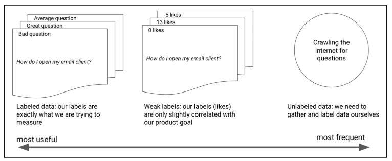
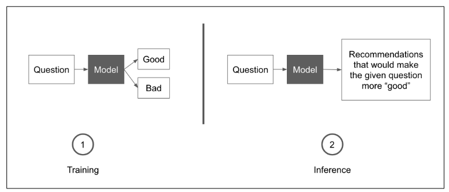

# Building Machine Learning Powered Applications
- URL: https://www.oreilly.com/library/view/building-machine-learning/9781492045106/
- Author: Emmanuel Ameisen
- Released: January 2020
- Publisher(s): O'Reilly Media, Inc.
- ISBN: 9781492045113

# Preface

- > "Deploying ML as part of an application requires a blend of creativity, strong engineering practices, and an analytical mindset."

- > "To successfully serve an ML product to users, you need to do more than simply train a model. You need to **thoughtfully translate your product need to an ML problem, gather adequate data, efficiently iterate in between models, validate your results, and deploy them in a robust manner**."

## The ML Process
- Four key successive stages
    1. **Identifying the right ML approach**:  ML is broad- the best approach for a given problem will depend on many factors such as success criteria, data availability, and task complexity. The goals of this stage are to **set the right success criteria** and to **identify an adequate initial dataset and model choice**.
   
   2. **Building an initial prototype**: Start by building an **end-to-end prototype with no ML involved. This will allow you to determine how to best apply ML**
   
   3. **Iterating on models**: Now that you have a dataset, you can train a model and evaluate its shortcomings. The goal of this stage is to repeatedly alternate between error analysis and implementation."

   4. **Deployment and monitoring**: Once a model shows good performance, you should pick an adequate deployment option. **Once deployed, models often fail in unexpected ways.**

# Part 1 - Find the Correct ML Approach

# Chapter 1 - From Product Goal to ML Framing

- It is important to **identify which parts of a product would benefit from ML** and how to **frame a learning goal** in a way that **minimizes the risks of users having a poor experience**.

- An application that calculates your taxes automatically should rely on guidelines provided by the government. The use of ML for automatically generating tax returns a dubious proposition.

- > "You **never want to use ML** when you can solve your problem with a **manageable set of deterministic rules**."

## Estimate what is possible

- Guidelines that can help you reduce the risk associated with tackling an ML project: 
  - Always start with a product goal to then decide how best to solve it. At this stage, be open to any approach whether it requires ML or not. 
  - When considering ML approaches, evaluate them based on how appropriate they are for the product, and not based on how interesting the methods are
  - The best way to do this is by following two successive steps: 
    1. **Framing your product goal in an ML paradigm**
       - start thinking of what service we want to deliver to users
       - for one product goal, there are usually many different ML formulations, with varying levels of implementation difficulty.
    2. **Evaluating the feasibility of that ML task**
       - consider multiple potential ML framings and start with the ones we judge as the simplest

### Models
- **weakly supervised algorithms** leverage labels that aren’t exactly the desired output but that resemble it in some way.

- Generally, supervised approaches are easier to validate since we have access to labels to assess the quality of a model’s prediction.

- While creating a labeled dataset can sometimes be time-consuming initially, it makes it much easier to build and validate models.

- Some standard appraches:
    1. **Classification and regression**
       - Methods to tackle regression and classification  have significant overlap
       - Most classification models output a probability score for a model to belong to a category. The classification aspect then boils down to deciding how to attribute an object to a category based on said scores.
       -  Classification model can be seen as a regression on probability values.
    2. **Knowledge extraction**
       - NLP: extracting spans, categorizing them
       - Images: finding areas of interest and categorizing them
       - Extracted information can be used as an input to another model. 
       - Eg. pose detection model:
         - extract key points from a video of a yogi
         - second model classifies the pose as correct or not based on labeled data
    3. **Catalog organization**
       - Often produce a set of results to present to users. 
       - Results can be conditioned eg.
         - an input string typed into a search bar
         - an uploaded image
         - a phrase spoken to a home assistant 
       - **Collaborative**: Recommendations are based on learning from previous user patterns
       - **Content based**: Recsys based on particular attributes of items
       - Some systems leverage both collaborative and content-based approaches.
    4. **Generative models**
       - Have outputs that are less constrained
         - riskier choice for production.
         - starting with other models first unless absolutely necessary

### Data
- If a dataset contains features that are predictive of the target output, it should be possible for an appropriate model to learn from it. 
- Most often we do not initially have the right data to train a model to solve a product use case from end-to-end.
- Rarely  able to find the exact mapping we are looking for.
- >**It is common to mistake the dataset that you find for the dataset that you need.**

- **Weakly labelled**: contain labels that are not the perfect modeling target, but somewhat correlated 
  - Playback and skip history for a music streaming service are examples of a weakly labeled dataset for predicting whether a user dislikes a song. 
  - If they skipped it as it was playing, it is an indication that they may have not been fond of it. 
  - Weak labels are less precise but  easier to find than perfect labels.

- Case study 
  -   

  - Perfect case: an ideal dataset would be a set of user-typed questions, along with a set of better worded questions. 
  - A weakly labeled : many questions with some weak labels indicative of their quality such as “likes” or “upvotes.” 
    - Helps a model learn what makes for good and bad questions but would not provide side-by-side examples for the same question.

 
- In practice, most datasets that we can gather are weakly labeled.
- **Having an imperfect dataset is entirely fine and shouldn’t stop you**. 
  - ML process is iterative in nature, 
  - Starting with a dataset and getting some initial results is the best way forward, regardless of the data quality.

## Framing the Editor

### Trying to Do It All with ML: An End-to-End Framework
- **Data**
  - Could attempt to gather a dataset of poorly formulated questions, and their professionally edited versions. Then use a generative model to go straight from one text to the other.
  - Expensive
  - Time consuming
  - Need professional help
- **Models**: 
  - Seq2Seq models?
    - success of these models has mostly been on sentence-level tasks, no longer than a paragraph
    - slow to train
    - If it needs to be retrained hourly or daily, training time can become an important factor
- **Latnecy**
  - slow to train
  - can take a **few seconds at inference time**, as opposed to subsecond latency for simpler models
- **Ease of implementation**
    - other teammates may need to iterate on this?
      - choose a set of simpler, more well-understood models
      - 

### The Simplest Approach: Being the Algorithm
- Leverage prior art to define what makes a question or a body of text well written. 
- Consult a professional editor or research newspapers’ style guides to learn more.
- Dive into a dataset to look at individual examples and trends and let those inform our modeling strategy.

- Case study
  - **Prose simplicity**: Use simpler words and sentence structures
  - **Tone**: Measure the use of adverbs, superlatives, and punctuation to measure the polarity of the text
  - **Structural features**: Extract the presence of important structural attributes such as the use of greetings or question marks.

- Now **build a simple solution with no ML involved** to provide recommendations. This phase is crucial for two reasons: 
  1. it provides a baseline that is very quick to implement 
  2. serve as a yardstick to measure models against

### Middle Ground: Learning from Our Experience
- Once we have a baseline set of features, attempt to use them to **learn a model of style from a body of data**. 
- To do this, train a classifier to separate good and bad examples
- Inspect it to identify which features are highly predictive and use those as recommendations.
-   

- **Dataset**
  - gather questions from an online forum along with some measure of their quality, such as the number of views or upvotes
  - cheaper and easier
- **Model**
  - Consider two things here: 
    1. how predictive a model is 
       - can it efficiently separate good and bad articles
    2. how easily features can be extracted from it 
       - can we see which attributes were used to classify an example
- **Latency**
  - classifers are quick
  - return results in less than a tenth of a second on regular hardware
- **Ease of implementation**
  - well understood

- Start with a human heuristic and then build this simple model to have an initial baseline
- Great way to inform what to build next

## Monica Rogati: How to Choose and Prioritize ML Projects
- only use ML if it makes sense
- design the product around handling ML failures gracefully
- formulate our suggestions differently based on the confidence score
  - above 90% - prominent recommendation
  - 50 - 90%  - display with less emphasis
  - less than 50% - do not display

- find the **impact bottleneck**- the piece of your pipeline that could provide the **most value if you improve on it**

- If there are problems around the model, **replace the model with something simple and debug the whole pipeline**
  - Frequently, the issues will not be with the accuracy of your model. 
  - Frequently, your product is dead even if your model is successful.
- The goal of our plan should be to derisk our model. 
  - Evaluate worst-case performance. eg. suggesting whichever action the user previously took
  - If we did this, how often would our prediction be correct, and how annoying would our model be to the user if we were wrong? 
  - Assuming that our model was not much better than this baseline, would our product still be valuable?
  -** Oftentimes in summarization, for example, simply extracting the top keywords and categories covered by an article is enough to serve most users’ needs.**
-I encourage publicizing before you even start on a project. That helps you avoid working on something just because you thought it was cool and puts the impact of the results into context based on the effort
- > At LinkedIn, we had access to a very useful design element, a little window with a few rows of text and hyperlinks, that we could customize with our data. This made it eas‐ ier to launch experiments for projects such as job recommendations, as the design was already approved
- **It is always valuable to spend the manual effort to look at inputs and outputs of your model.** Scroll past a bunch of examples to see if anything looks weird.
  - A naive way to recommend groups - the most popular group containing their company’s name in the group title. After looking at a few examples, we found out **one of the popular groups for the company Oracle was “Oracle sucks!”** which would be a terrible group to recommend to Oracle employees.
- Looking at your data helps you think of good heuristics, models, and ways to reframe the product. 
  - If you rank examples in your dataset by frequency, you might even be able to quickly identify and label 80% of your use cases.
  - > At Jawbone, for example, people entered “phrases” to log the content of their meals. By the time we labeled the top 100 by hand, we had covered 80% of phrases and had strong ideas of what the main problems we would have to handle, such as varieties of text encoding and languages
- The last line of defense is to have a **diverse workforce** that looks at the results. This will allow you to catch instances where a model is exhibiting discriminative behavior, 
  - tagging your friends as a gorilla
  - is insensitive by surfacing painful past experiences with its smart “this time last year” retrospective
  - 