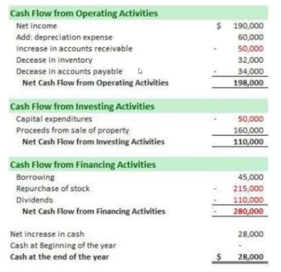

# Complete Investing Course
Instructor: Mohsen Hassan
URL: https://www.udemy.com/course/complete-investing-course-stocks-etfs-index-mutual-funds

## Resources
- [Trading view - Market Charts](https://www.tradingview.com/chart)
- [Trading view - Screener](https://www.tradingview.com/screener/)
## 1. Introduction
- Investment products
  - Stocks
  - Bonds
  - Commodities
    - Gold
- Investment vehicles: way that you invest through these products
  - Underlying assets (buy investment productsd directly)
  - Mutual funds
  - Index funds
  - ETFs

- Why invest?
  - Grow wealth
    - Calculate your net worth (assets, liabilities)
    - You want this to grow over time
  - Retire
    - replace your income, and enjoy a bit
    - 40 years * 15% of income * broad based index fund = more than all income you made from 40 years of work
    - Conversely 2% of mutual fund fee could eat up 40% of retirement account
  - Make a big purchase
    - Buy a house/car
    - Travelling around the world

## 2. Fundamentals of Stocks
### Inflation
- **Inflation**: Decline of purchasing power of a given currency over time. A quantitative estimate of the rate at which the decline in purchasing power occurs can be reflected in the increase of an average price level of a basket of selected goods and services in an economy over some period of time
- Everything gets more expensive over time
- Government wants there to be an inflation: target inflation. 
- Inflation is often measured using the Consumer Price Index
- **Consumer Price Index** (CPI): a measure that examines the weighted average of prices of a basket of consumer goods and services, such as transportation, food, and medical care. It is calculated by taking price changes for each item in the predetermined basket of goods and averaging them.
- Indexes are formulae that keep track of things - there are indexes for stocks, housing etc.
- **Because of inflation, if we don't spend our money right away, our money will be worth less.** 😲
- Cash is thus the *worst long term* investment you can have.
- We need to beat inflation with our investments

### Compounding
- **Compounding**: Process of reinvesting the interest earned on your investment so that during the next period, you earn interest not only on the invested capital but also the accumulated interest
- $10_000 @ 10 % interest * 20 years
  - Simple interest: $20_000
  - Compound interest: $37_275

## 3. Stocks
-  **Private corporation**: a business entity owned by a small number of shareholders. Private corporations don't issue shares to the public. Since private corporations don't opt for an initial public offering (IPO), their shares are not traded on stock exchanges. 
- In general, the shares of these businesses are less liquid, and **their valuations are more difficult to determine.** 
- The high costs of an IPO is one reason companies choose to stay private.
- **If someone sues you for a product malfunction, they can't sue you- they can only sue the private corporation that makes them.**
- So there's limited liability. Plus lots of tax benefits (because companies have expenses)
- **Stocks (or shares)**: Investments that represent part ownership in a corporation. When you buy shares in a company, you own portionally a part of that company.
- Its not easy selling equity to people- you need to know the person, you need to see a lawyer, draft and sign a document. This is where a public corporation comes in. 🎊
- Recommended article: [How startup funding works](https://blog.adioma.com/how-funding-works-splitting-equity-infographic/)

- Public companies have to get audited every 3 months. We trust they're not fraudulent.
- **Initial Public Offering**: Change from Private to Public. Investment bankers want to be your underwriters. The bank prepares your IPO paperwork and calls up wealthy clients through their connections ("primary market") to sell them your stock. Lead underwriters will get 7% of IPO.
- After a specific date, you're allowed to sell to the "secondary market" where you and I can buy the shares.

- **Market**: Place where people gather for purchase and sale of products. It's a place where commercial dealings are conducted.
- **Auction Market** - Buyers compete on buying prices, and sellers compete on selling prices simultaneously. Not your grocery store. Trade only happens when buyer and seller agree on a price.
- **Stock Market** - A market in which shares of publicly traded companies are issued and traded. The stock market provides companies with access to capital and provides investors an easy way to have ownership in companies.
- **Stock exchange** - A place where market participants can trade stocks with each other. Eg. NYSE, NASDAQ, AMEX. Its a brand of a stock market where only certain commodities are available in each (like "Best Buy" or "Apple Store")
- Stock exchanges in India: https://www.sebi.gov.in/stock-exchanges.html
- Some companies are *interlisted* - meaning they're listed in multiple countries and offer people of all those countries to buy their stocks.
- Some exchanges may only accept ETFs (?), while some may have very stringent requirements ( x amt of employees, enough money => NYSE)
- Each company needs a Ticker (AAPL, FB, TSLA)
- We're not going to actually fly to NY to trade at NYSE. That's why we need a broker.
- **Broker**: A firm that facilitates in the execution of a financial transaction for a fee.
- **Legacy system** 
  - Buyer -> Local Broker -> Floor Trader (NYSE) -> Local Broker -> Seller
- **Current system**
  - Digitized (servers at local and floor trader)
  - Broker is now a software 
  - Why can't you do this directly now? Why need brokers?
    - Because there are other considerations:
      - Are you going to be able to pay up?
      - Settlement of securities
      -  "+ bunch of other things"
  - Fees to trade have dramatically dropped
- **Shares outstanding**: Total shares available for a company
- Why does a company go to secondary markets, when they have already made their money in the primary market?
  - If people tell you that you can buy stocks but never sell them, would you want to buy them?
  - Enabling people to sell them anytime increases the value of the commodity

- If your broker ever calls you saying he has new IPO stocks, and asks if you want to get in, **run the other way**.
  - It means no body else wanted those shares
  - At an IPO, the shares get sold quickly. 
  - **You'll never be able to buy stocks at IPO price.**

- Market is open from 9:30am - 4:00pm, but there's also:
  - "Premarket trading"
  - "Afterhours trading"
  - Highly discouraged to trade at those times.

- **Orders**
  - **Limit order** : Buy or sell a financial product at a specific price or better. You are not guaranteed to get filled on this order type.
  - **Market order** : Sell or buy right away no matter the price. 

- **Order book**: 
    
<table>
<tr>
  <td>Buyer</td>
  <td>Seller</td>
</tr>
<tr>
  <td>Niyas - 500 @ $27.00</td>
  <td>Ram - 500 @ $31.00</td>
</tr>
<tr>
  <td>Riyas - 500 @ $29.00</td>
  <td>Raj - 1000 @ $32.00</td>
</tr>
<tr>
  <td></td>
  <td>Salut - 20_000 @ $38.00</td>
</tr>
</table>

- Bid: $29.00 
- Ask : $31.00 (for Market type orders)
- Last Trade: No trade yet

- Eg order # 1
  - Order Type: Limit
  - Quantity: 1000
  - Ticker: SB
  - Side: Sell
  - Price: $ 32.00

- Eg order # 2
  - Order Type: Market
  - Quantity: 100
  - Ticker: SB
  - Side: Buy

- Order # 2 gets executed immediately 
  - Buyer gets "complete fill" (100 shares)
  - Seller gets "partial fill" (100 shares - 400 left unsold)
  - Last trade: $31.00

- This is how share prices fluctuate. 
  - Its based on supply and demand, and not company profits.
  - Supply and demand may be based on company profits (and news articles, and gossip...)
- For big companies, Bid and Ask are very close because there are so many orders
- Charts
  -   

- **Volume**: Quantity of shares traded in a specific period
- Charts will also show **Earnings** and **Dividends**

## 4. Fundamentals
- **Market Capitalization**: Total market value of a company (stocks outstanding * current stock price)
  - Mega Cap: > 200 billion
  - Large Cap: 10b - 200b
  - Mid Cap: 2b - 10b
  - Small Cap: 300m - 2b
  - Micro Cap: 50m - 300m

- When the market is going up, a lot of the small cap companies are going to do better than others
- **Screening**: Process of finding information
- Some companies may issue two classes of shares- one without (or minimal) voting rights, and one with major voting rights when they do not want to lose control of the company. Eg. `GOOG` and `GOOGL`
- **Financial statements**: Companies are obliged to release these on a quarterly basis. These statements are:
  - **Balance Sheet**: Reports on company's assets, liabilities, and owner's equity. It also has a section for management discussion and analysis. 
    - Equity = Assets - Liabilities
  - **Income statement**: AKA Earning statement, reports on the company's financial performance. This is where earnings are disclosed. It will show revenue, expenses, and net profits.
  - **Cash flow statement**: Reports on the cash entering and exiting the company. Three forms:
    - Core operations
    - Investing
    - Financing
  - Company needs to be clear where they got their money from- if its not from **Core Operations** then its borrowed money / sold buildings and such.
  -   
  - Analysts and Portfolio managers are going to go through these, along with a lot of additional info (sales forecast, etc.) 
  - There are a few ratios that are important

- **Earnings (E)**: The net profit made by a company in a period
- **Earnings per share (EPS)**: Earnings made in a period divided by the number of shares outstanding. 
- **Price to earnings (P/E)**: Ratio `(share price) :(earnings per share)`. Tells you how much you are paying for each dollar of earnings the company makes. Used to see if company is overvalued or undervalued.
- Eg. 
  - EPS of AMZN = 26
  - EPS of WLMT = 6
  - Stock Price of AMZN = 3200
  - Stock Price of WLMT = 144
  - Since WLMT is cheaper, you can buy more shares of WMLT and end up more profitable than if you bought AMZN
  - This is why we use P/E
- Why would anyone buy TSLA which has a P/E of 1130?
  - Because you're predicting that their Earnings will grow high very fast in the next few years. 
  - Predicted P/E for TSLA will be 110.
  - Which means if you  buy a share now, you'll make a killing in a few years
  - Why si the current price so high? Because other people also are using the same strategy - they're buying TSLA stocks now which is driving up the price.
- **Growth companies**: Companies that are not generating as much income relative to their price, but that are expected to have a high earning growth in the future. These companies have a high PE ratio and high PB ratio and do not give out dividends.
- **Value companies**: Mostly companies that are mature and expecting good income relative to their price. They don't expect their income to grow very much in the future. Low P/E, low P/B, and give out dividends.
- **Forward Price to Earnings** : Next years predicted P/E
- 