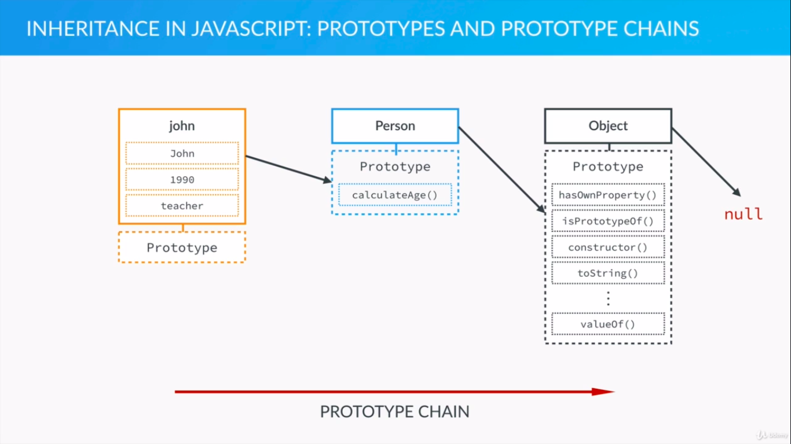
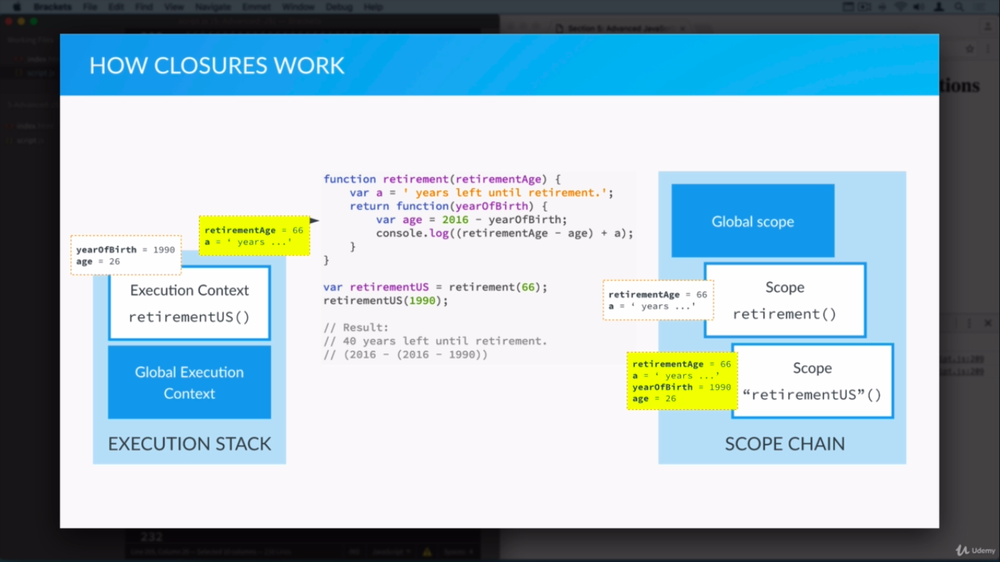

# The Complete Javascript Course
*Course Link*: https://www.udemy.com/course/the-complete-javascript-course/
*Instructor*: Jonas Schmedtmann

- Operator precedence: https://developer.mozilla.org/en-US/docs/Web/JavaScript/Reference/Operators/Operator_Precedence
- Switch case can be used to check conditions
  ```javascript
  switch(car){
        case 'honda': 
            console.log("Honda goes hoooondaaaa");
            break;
        case 'audi':
        case 'volvo':
            console.log("Audi and volvo don't go")
  }

  // Now we're looking where the case's condition turns true
  switch(true){
        case (age < maxage): 
            console.log("Still eligible");
            break;
        case (age > maxage):
            console.log("Not eligible");
            break;
  }
  ```

### Statement vs Expresssion
- Statement need not run immediately eg. `if` statement
- Expression is evaluated on the spot eg. `x+=4`

### Truthy and Falsy values
- Falsy values are
  - `undefined`
  - `null`
  - `0`, `-0`, `0n`
  - `false`
  - `""`
  - `NaN`
- Everything else is truthy
  - **Warning**: negative numbers are truthy

### Operators
- `==` will coerce types 
  - `23 == "23"` is `true`
- `===` will not coerce types
  - `23 === "23"` is `false`

### Arrays
- Unlike in most languages, you can index beyond the length of the array
```javascript
var names = ["John", "Mark", "Niyas"];
names[5] = "Charlie"
// ["John", "Mark", "Niyas", 2xempty, "Charlie"]
// empty means undefined
```

## Section 3: How Javascript works behind the scenes
- JS code is usually hosted in a browser/nodejs/other apps
- Host contains a JS engine that executes it
- V8, SpiderMonkey, Javascript core etc. are all engines

- JS engine does the following
  - Parser --correctly parsed code--> AST
  - AST ---> Conversion to Machine Code
  - Machine code --> CPU execution

### Execution context
  - A contianer which stores variables and in which a piece of our code is executed or evaluated
  - Default execution context is always executed in the global context and associated with the global object
  - Global context is where all the code that that isn't inside a function is executed. In the browser, that's the `window` object.
  - ```javascript 
    lastName === window.lastName //true
    ```
  - execution contexts are stacked on the global context  
 
      

- Execution context can be treated as an object with 3 properties
  - Variable object: contains fn args. any other var declarations,fn declarations
  - Scope chain: contains current var obj (pointer??) as well as var obj of all its parents
  - `this` variable

- When a function is called a new exec context is put on top of the execution stack. This happens in 2 phases
  1. Creation phase
     - Creation of the variable object
     - Creation of the scope chain
     - Determine value of the `this` variable

  2. Execution phase
     - code of the fn that created the execution context is run line by line

### Variable object creation
1. `argument` object is created containing all the arguments that were passed to the function
1. Code is scanned for fn declarations and for each fn, a property is created in the VO, pointing to the fn
1. Code is scanned for var declarations and for each var value is set to undefined
1. Last 2 points together is called "hoisting"
1. All the fn are already defined before the execution phase starts, while vars are set to `undefined` and will only be defined in the exec phase

```javascript

// `sayHello` fn runs even though the fn def is below the fn call due to hoisting
sayHello("@niazangels");

function sayHello(name){
  console.log("👋 " + name);
}

// `shout` isn't declared as a function- it's a variable,s so the following code raises an error
shout("@yolo")

var shout = function(text){
  return text.toUpperCase();
}

// Arrow fns behave just like variables, the following will raise an error
sayByeBye("@nsync");

sayByeBye = (name) => {
  console.log(name + " 👋");
}
```


```javascript

console.log(age); // undefined
var age =10;
console.log(age); // 10


console.log(address); // Error: `address` is not defined
```

### Scoping
- Scoping answers the question: where can I find this var
- Each new fn creates a scope. Not `for`/`if`/`while` blocks as with some other languages
- Lexical scoping: nested fn gets access to vars in outer fn

  

  

### `this` keyword
  - In a regular fn call, `this` points to the global object. i.e. the `window` object in a browser
  - In a method call, `this` points to the object that is calling the method
  - `this` **is not assigned a value until a fn where it is actualy called** 😲


```javascript
var john = {
  name: "John",
  yob: 1990,
  calcAge: function(){ 
    console.log(this); // will show `john` object if we invoked this via john.calcAge()
    console.log(2020 - this.yob); 
    }
}

john.calcAge() // logs `john` and  30

var mike = {
  name: "Mike",
  yob: 2000
}

//  Method borrowing
mike.calcAge = john.calcAge
mike.calcAge() // logs `mike` and 20
```

## Section 4: DOM Manipulation
- Document Object Model
  - Structured representation of HTML page
  - Used to connect webpages to scripts like JS
  - For each HTML box, there's an object in the DOM we can access and interact with

- JS is not DOM. JS interacts with DOM

### Basics

- `document.querySelector` selects DOM objects just like CSS but only the first element.
- `document.querySelector(obj).style` can be used to get/set all css properties such as `style.display = None`


### Events

- Events are notifications sent to the code that something has happened on the page
- Event listener is a fn that performs an action based on a certain event
- **An event can only be handled when the execution stack is empty** 🤯 
- So all exec stacks should have returned
- Besides the Execution stack, we also have a message queue in the JS engine
- The events sit waiting to be processed until we return to global context
- When it does, the next ev gets processed
- So the ev handler picks it up and it gets its own execution context
- `DOMobject.addEventListener('click', fn)`
- Anonymous fn does not have a name and hence cannot be reused 
- `getElementById` is faster than `querySelector`


## Section 5: Objects and Functions
- "Everything is an object. Except the primitives"
- Numbers, Strings, Booleans, Undefined, Null are all primitives
- Everything else including Arrays, fn, Dates are all objects

### Prototypal inheritance
- In other programming languages, its called a class. In js its called a constructor or prototype
- Each and every js obj has a prototype property
- Prototype property is where we put methods and properties that we want other objects to inherit 
- Constructor's prototype property is not the prototype of the constructor itself, it's the prototype of all instances created through it.
- When a prop or method is called, the search starts in the instance and follows the prototype chain
  

- **@niazangels: This is the Prototype design pattern 😲**
- All prototypes inherit from the `Object` prototype which inherits from the `null` primitive. 
- So if the parameter is not found it is `undefined`. Wut? 😕

### The `new` keyword
- `new` creates an empty `Object`
- Attaches it to the `this` keyword in the context for running the fn
- If we dont attach to `this`, `this` would point to the global excon
- value is usually stored as a var

```javascript
var Person = function(name, yearOfBirth, job){
  this.name = name;
  this.yearOfBirth = yearOfBirth;
  this.job = job;
}

// Only the prototype needs this, not each object
Person.prototype.calculateAge = function(){
  console.log(2020 - this.yearOfBirth);
}

// You can use the same for properties but its less common
Person.prototype.lastname = "Smith";

var john = new Person("John", 1990, "developer");
var jane = new Person("Jane", 1980, "designer");
var steve = new Person("Steve", 1970, "sales");


john instanceof Person; //true

john.__proto__ === Person.prototype; //true
john.__proto__ === jane.__proto__; //true

john.hasOwnProperty('job'); //true
john.hasOwnProperty('lastname'); //false

```

How to inspect objects
```javascript
console.info([1,2,3])
```


### `Object.create` to create new objects
- First define the object that act as the prototype
- Then create an object based on that very prototype


```javascript
// Note that this is no longer a fn constructor
var personProto = {
  calculaeAge: function(){
    console.log(2020 - this.yearOfBirth);
  }
}

var john = Object.create(personProto);
john.name = "John";
john.yearOfBirth = 1990;
john.job = "dev";

var jane = Object.create(personProto, {
  name: { value: "Jane"},
  yearOfBirth: { value: 2000},
  job: { value: "designer"},
});

```

### Object.create vs Fn prototype 
- Obj.create builds an object that directly inherits from the one that we've passed into the first argument
- In Fn constructor, the newly created obj inherits from the fn constructor's prototype property


### Primitives and Objects
- Variables containing primitives contain their value inside the variable itself.
- Vars associated with objects do not contain that object, but instead contain a reference to a place in memory where the obj is stored

```javascript
var a = 23;
var b = a;
a = 46;

console.log(a); // 46
console.log(b); // 23
```

```javascript
var a = { name: "John" };
var b = a;

a.name = "Jane";

console.log(a); // Jane
console.log(b); // Jane
```

```javascript
var a = 23;
var b = {name: "John"}

function change(x, y){
  x = 46;
  y.name = "Jane";
}

change(a, b);

console.log(a);
console.log(b);

```

### Function
- Fn are instances of obj type
- Fn behaves like any other obj
- We can store fn in a var
- We can pass fn as args to another fn
- We can return a fn from a fn
- So we say in JS fn are first class objects


### Immediately invoked fn expressions

- Not for reusability, but for data privacy
- IIFE hides vars from the current context
- With IIFE you dont need to define a new fn and keep it in memory
- It involves creating a fn expression and invoking it immediately
```javascript
  (function(){
    // Code
  })() // Call this at the end!
```
- An anonymous fn is defined and wrapped in paranthesis
- The paranthesis around the fn def tricks the parser into believing this is an expression and not a declaration
- Without this wrapping paranthesis, the parser would break because there is no name
- Also immediately invoke the fn with a succeeding paranthesis open and close

```javascript
(function(goodLuck) {
    if ( ((Math.random() * 10) + goodLuck) >= 5 ) {
      console.log("Winner!")
    }
})(3)
```

### Closures

- An inner fn always has access to the vars and params defined in it's outer fn, **even after the outer fn has returned**!

```javascript
function retirement(ageLimit) {
  var template = " years left":
  return function(age){
    console.log( (ageLimit - age) + template)
  } 
}

retirementIndia = retirement(68);
retirementIndia(20);
```
- Scope stays intact and variables stay on execution stack (?) even after outer fn excon is popped.
- This can be accessed by inner fn
- In the following 
  

### `call`,`apply` and `bind`

- `call` is used for method borrowing
- `apply` is the same but uses an array instead of accepting multiple args
- `bind` creates a copy of the fn with the passed in arguments as default args

```javascript
var john = {
  name: "John",
  greeting: function(style, timeOfDay){
    if (style == "formal") {
      console.log("Good " + timeOfDay + " everyone. My name is " + this.name );
    } else if (style == "friendly") {
      console.log("What's up? I'm " + this.name + ". What're  you upto this " + timeOfDay + "?");
    } 
  }
}

john.greeting("friendly", "morning");

jane = { name:"Jane" }

// The first arg is what `this` should be mapped to. All other args are fn args.
john.greeting.call(jane, "formal", "evening")

// Same for `apply`, but all args are passed in as an array
john.greeting.apply(jane, ["formal", "night"])

// Bind creates a copy of the fn with the default args as passed in
var johnFormal = john.greeting.bind(john, "formal")
johnFormal("day");
```

### Budgety App
- Separate modules based on responsibility
- BudgetController does not depend on UI Controller
- So even with an updated UI need not change anything in BudgetController
- All classes are created as IIFE for data privacy
- The overall layout is as follows

```javascript

var BudgetController = (function(){
  //code
})();

var UIController = (function(){
  //code
})();

var AppController = (function(UICtrl, BudgetCrtrl){
  // Notice that the args have different names so that if we ever change
  // the name of the `UIController` class, we don't need to update it in here 

  return {
    init: function(){
      // Main 
    }
  }
})(UIController, BudgetController);

AppController.init()

```

- To convert list to Array:
```javascript
var arr = Array.prototype.slice.call(list)
```

### Event delegation

- An event is triggered on some DOM element, but its also fired for all its parent elements one at a time upto and including the root element
- Event bubbles up in the dom tree
- The target element is stored as a property in the event, so all parent elements will also know the target element
- We can attach an event handler to the parent element and wait for the event to bubble up
- This is called Event delegation
- Why do we need event delegation?
  - Lots of child elements
  - Ev handler for an element that's not yet in the DOM


### More array methods
- Difference between `.map` and `.forEach` is that `map` returns a new item for each current
- `arr.splice(startinIndex, noOfElementsToRemove)`

### Adding and removing nodes to UI
- You can only remove a child. So if you want to delete an element, you need to `element.parentNode.removeChild(element)` 


## Section 7: Intro to ES6 / ES2015

### let vs var vs const
- `var` is function or window scoped. There is no notion of block scopes in `var`.
- `let` is block scoped. This means even within a fn it is inaccessible outside the block
- `const` cannot be changed after assignment

```javascript
function varTest(condition){
  if (condition){
    var name = "Niyas";
    var yob = 1990;
  }
  console.log(name + " was born in " + yob);
}

varTest(true); // Niyas was born in 1990
```

```javascript
function letconstTest(condition){
  if (condition){
    console.log(name) // Uncaught ReferenceError: Cannot access 'name' before initialization
    // This is called temporal deadzone. The variables are hoisted but we cannot access them yet.
    let name = "Niyas";
    const yob = 1990;
  }
  console.log(name); // undefined (because now the scope changed and its treated as a var)
  console.log(yob); // Uncaught ReferenceError: yob is not defined
}

letconstTest(true); // 
```


### Blocks & IIFE
- blocks are a much simpler way to achieve data privacy
- Simply enclose code in curly braces

```javascript
  {
    const a = 1;
    let b = 2;
    var c = 3;
   
   console.log( a + b ) // 3
  }
    console.log( a + b ) // Uncaught Reference error: a is not defined
   console.log(c) // 3, because var is function scoped, not block scoped

```

### Strings
- Template literals
  - Ensclose string in backticks
  - Encapsulate variables or expression in curly braces with a dollar in front
- Methods
  - `string`.startsWith
  - `string`.endsWith
  - `string`.includes
  - `string`.repeat(4)

```javascript
let firstName = "John";
let lastName = "Smith";

console.log(`The person is ${firstName} ${lastName}(${calculateAge(1990)})`)
```

### Arrow functions
```javascript
const years = [1990, 1992, 1997, 2000]

// ES5
var ages = years.map(function(el){
  return 2020 - year;
})

// ES6 
let ages = years.map(el => 2020 - el);
```

- Again, only method calls have access to the object via `this`
- Any regular fn, or a callback fn defined inside a method, or an anonymous fn inside a `.map` does not have access to the obj- it's `this` refs to the window obj


#### An example

```javascript
var box_es5 = {
  color: 'green',
  position: 1,
  clickMe: function(){
    document.querySelector('.green').addEventListener('click', 
    function(){
      // the following will ref to window.color and will be undefined
      var msg = `${this.color} box is in pos no. ${this.position}`;
      alert(msg);
    })
  }
}

box_es5.clickMe()
```

Here's a workaround:
```javascript
var box_es5_w = {
  color: 'green',
  position: 1,
  clickMe: function(){
    // Scope `this` to a var
    var self = this;
    document.querySelector('.green').addEventListener('click', 
    function(){
      // Use the scoped var
      var msg = `${self.color} box is in pos no. ${self.position}`
    })
  }
}

box_es5_w.clickMe();
```

```javascript
const box_es6 = {
  color: 'blue',
  position: 2,
  clickMe: function(){
    document.querySelector('.green').addEventListener('click', 
      () =>{
        // `this` is shared by its surrounding
        let msg = `${this.color} box is in pos no. ${this.position}`;
        alert(msg);
      })
  }
}

box_es6.clickMe();
```

- Here's an extreme version that doesnt work as expected
```javascript
const box_es6_nw = {
  color: 'blue',
  position: 2,
  // Reducing the below to an arrow fn will mean that `this`
  // will refer to the global context again
  clickMe: () => {
    document.querySelector('.green').addEventListener('click', 
      () =>{
        // The following will thus give `undefined`
        let msg = `${this.color} box is in pos no. ${this.position}`;
        alert(msg);
      })
  }
}

box_es6_nw.clickMe();
```

#### Another example

```javascript
function Person(name){
  this.name = name 
}

// ES 5 
Person.prototype.friends_es5 = function(friends) {
  var arr = friends.map(
    function(el){
    // The following won't work because current scope is an 
    // anonymous fn which has global scope
    return `${el} is friends with ${this.name}`; }
  )
  console.log(arr);
}

// ES 5 - Workaround
Person.prototype.friends_es5_w = function(friends) {
  var arr = friends.map(
    function(el){
      return `${el} is friends with ${this.name}`
    // Now we can bind `this` within `Person.prototype.friends_es5_w` to this inside the anon fn  
    }.bind(this)
  );
  console.log(arr);
}

// ES 6
Person.prototype.friends_es6 = friends => {
  let arr = friends.map(el => { return `${el} is friends with ${this.name}`});
  console.log(arr);
}
```


### Destructuring
```javascript
const [name, age] = ["John", 26];

const person = {
  name: "Niyas",
  age: 26
}

const {name, age} = person;
console.log(name, age); 

// Renaming
const {name: playerName, age: playerAge} = person;
console.log(playerName, playerAge); 
```

## Arrays

- Now there's a `Array.from` to convert a nodelist into an arra (instead of the Array.prototype.slice hack)
  ```javascript
  Array.from(nodelist).forEach(el => {el.style.backgroundColor = 'dodgerblue'})
  ```
  
- In ES5 `Array.prototype.forEach` / `map` you cannot break/continue
- Here's an alternative to the following

```javascript
// ES5
var boxes = document.querySelectorAll('.box');
var boxes_arr = Array.prototype.slice.call(boxes);

for (var i=0; i< boxes_arr.length; i++){
  if (boxes_arr[i].className === 'box blue'){
    continue;
  }
  boxes_arr[i].style.backgroundColor = "dodgerblue"
  boxes_arr[i].textContent = "I have turned blue";
}


// ES6
const boxes = Array.from(document.querySelectorAll('.box'));
for (const box of boxes){
  if (box.className.includes("blue")){
    continue;
  }
  box.style.backgroundColor = "dodgerblue";
  box.textContent = "I have turned blue";
}
```

- Funnny thing: `boxes` and `box` are both const in the above example, but the box items are being modified. How is this possible?

#### Array.find , Array.findIndex

```javascript
// ES5
var ages = [2, 4, 6, 7, 21, 12, 14];
var over_18 = ages.map(function(el) {
  return el > 18;
})
var idx_over18 = over_18.indexOf(true);
var val_over18 = ages[idx_over18];
console.log(val_over18);

// ES6
const ages = [2, 4, 6, 7, 21, 12, 14];
const idx_over18 = ages.findIndex(el => el >= 18);
const val_over18 = ages.find(el => el >= 18);

console.log(idx_over18);
console.log(val_over18);
```

### Spread operator (unpacking)

```javascript
function add4(a, b, c, d){
  return a + b + c+ d;
}
console.log(add4(1,2,3,4));

// ES5
var values = [1,2,3,4];
// We pass null because we aren't interested in setting `this`
var ans = add4.apply(null, values);
console.log(ans)

// ES6
const values = [1,2,3,4];
console.log(add4(...values));
```

```javascript
const h = document.querySelector('h1');
const boxes = document.querySelectorAll('.box');
const all = [h, ...boxes];
```

### Rest parameters (opp. of spread parameter)
- Each fn gets access to an `arguments` variable

```javascript
// es5

// Notice we do not define fn parameters
function isFullAge_es5(){
  var args = Array.prototype.slice.call(arguments);
  args.forEach(function(el){
    console.log((2020 - el) > 18);
  })
}

isFullAge_es5(1960, 2018, 1950, 2012);

// ES6
function isFullAge_es6(...args){
  args.forEach(el => { console.log((2020 - el) > 18); })
}
isFullAge_es6(1960, 2018, 1950, 2012);
```

- Suppose we want to specify the full age:

```javascript
// es5

// Now we pass in just the limit as the fn parameter
function isFullAge_es5(limit){
  // Slice starting from the 1st position of arguments
  var args = Array.prototype.slice.call(arguments,1);
  args.forEach(function(el){
    console.log((2020 - el) > limit);
  })
}

isFullAge_es5(20, 1960, 2018, 1950, 2012);

// ES6
function isFullAge_es6(limit, ...args){
  args.forEach(el => { console.log((2020 - el) > limit); })
}
isFullAge_es6(20, 1960, 2018, 1950, 2012);
```

### Default parameters

```javascript

// ES5

function SmithPerson(firstName, age, lastName, nationality){
  
  lastname = (lastName === undefined ? "Smith" : lastName);
  nationality = (nationality === undefined ? "Indian" : nationality);
  
  this.firstName = firstName;
  this.lastName = lastName;
  this.age = age;
  this.nationality = nationality;
}

john = new SmithPerson("John", 28);


// ES5

function SmithPerson(firstName, age, lastName='Smith', nationality='Austrian'){
  this.firstName = firstName;
  this.lastName = lastName;
  this.age = age;
  this.nationality = nationality;
}

jane = new SmithPerson("Jane", 28);
```

### Maps
- Hashmaps
- In ES5 we had to use Objects if we ever wanted to keep a dict/hashmap
- Now in ES6, maps fill this gap
- **In objs, we're limited to string type for keys. But in maps, we can use anything (even fn and objs)**
- You can also iterate through maps which cant be done in objs


```javascript
const question = new Map();
question.set("q", "What is the capital of India?");
question.set(true, "Delhi");
question.set(1, "Trivandrum");
question.set("three", "Lucknow");

console.log(question.size);

question.delete("three");
console.log(question.size);
console.log(question.has("three"));

// question.clear();

question.forEach((val, key)=>{
  console.log(`${key} : ${val}`);
})


for (let [val,key] of question) {
  console.log(`${key} => ${val}`);
}


// Notice the order changes when we use `.entries()`
for (let [key, value] of question.entries()) {
  console.log(`${key} => ${val}`);
}

```

### Classes

- Syntactic sugar around fn constructors
- Class definitions are not hoisted, so unlike fn constructors, we need to implement the class and only later can we use them
- We can only add methods to classes, and not properties (and inheriting propeties through obj instances is not best practice anyway)
```javascript

// ES5
var Person_es5 = function (firstName, lastName, yob){
   this.firstName = firstName;
   this.lastName = lastName;
   this.yob = yob;
 }

 Person_es5.prototype.calculate_age = function(){
   var age = new Date().getFullYear - this.yob;
   console.log(age);
 }

var john = new Person_es5("John", "Smith", 26);

// ES6
class Person_es6 {
  // Every class requires a constructor
  constructor(firstName, lastName, yob){
    this.firstName = firstName;
    this.lastName = lastName;
    this.yob = yob;
  }
  // There are no commas, semi colons etc. in between
  calculate_age(){
    var age = new Date().getFullYear - this.yob;
    console.log(age);
  }

  static greeting(){
    console.log("Hey there! ✌")
  }
}

var jane = new Person_es6("Jane", "Smooth", 24);
Person_es6.greeting();
```

### Subclassing and inheritence

```javascript
// ES5
var Person_es5 = function (name, yearOfBirth, job){
   this.name = name;
   this.yearOfBirth = yearOfBirth;
   this.job = job;
 }

 Person_es5.prototype.calculate_age = function(){
   var age = new Date().getFullYear() - this.yearOfBirth;
   console.log(age);
 }

var Athlete_es5 = function(name, yearOfBirth, job, olympicGames, medals){
  // Pass the current object to the Person_es5
  Person_es5.call(this, name, yearOfBirth, job);
  this.olympicGames = olympicGames;
  this.medals = medals;
}

// The following won't work
// Athlete_es5.prototype = Person_es5

// Object.create helps to manually set the prototype
// We want the prototype of the Athlete class to be the prototype of the Person class
Athlete_es5.prototype = Object.create(Person_es5.prototype);

// Once you change the prototype, add the fns
Athlete_es5.prototype.wonMedal = function(){
  this.medals ++;
}

john = new Athlete_es5("John", 2000, "accountant", 10, 0);
john.calculate_age();
john.wonMedal();
john
```

```javascript
// ES5
class Person_es6 {
 
  constructor (name, yearOfBirth, job){
    this.name = name;
    this.yearOfBirth = yearOfBirth;
    this.job = job;
}

 calculate_age(){
    var age = new Date().getFullYear() - this.yearOfBirth;
    console.log(age);
 }
}

class Athlete_es6 extends Person_es6{
  constructor(name, yearOfBirth, job, olympicGames, medals){
    super(name,yearOfBirth, job)
    this.olympicGames = olympicGames;
    this.medals = medals;
  }

  wonMedal(){
    this.medals ++;
  }
}

john = new Athlete_es6("John", 2000, "accountant", 10, 0);
john.calculate_age();
john.wonMedal();
john
```
