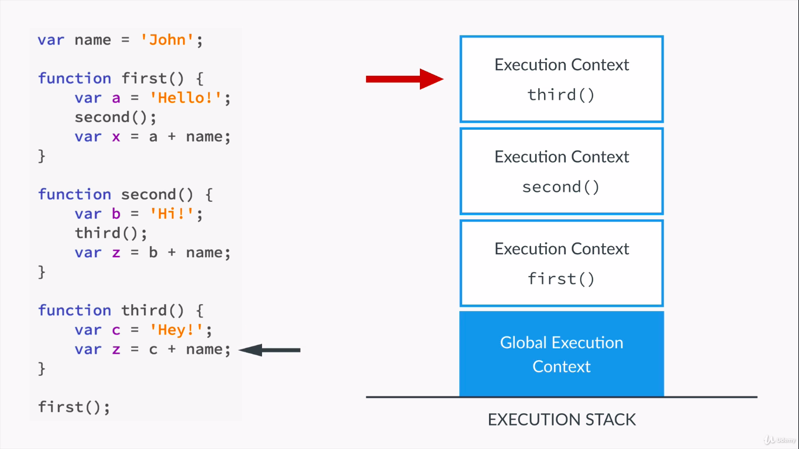
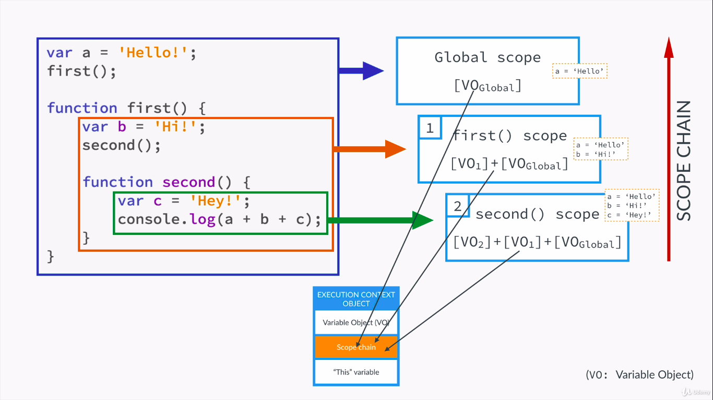
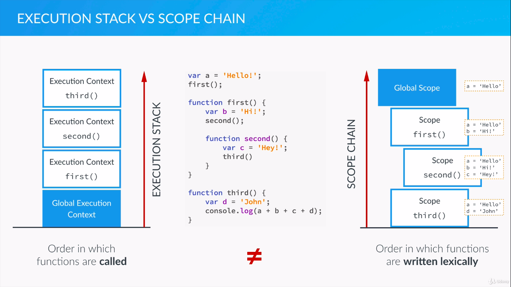

# The Complete Javascript Course
*Course Link*: https://www.udemy.com/course/the-complete-javascript-course/
*Instructor*: Jonas Schmedtmann

- Operator precedence: https://developer.mozilla.org/en-US/docs/Web/JavaScript/Reference/Operators/Operator_Precedence
- Switch case can be used to check conditions
  ```javascript
  switch(car){
        case 'honda': 
            console.log("Honda goes hoooondaaaa");
            break;
        case 'audi':
        case 'volvo':
            console.log("Audi and volvo don't go")
  }

  // Now we're looking where the case's condition turns true
  switch(true){
        case (age < maxage): 
            console.log("Still eligible");
            break;
        case (age > maxage):
            console.log("Not eligible");
            break;
  }
  ```

### Statement vs Expresssion
- Statement need not run immediately eg. `if` statement
- Expression is evaluated on the spot eg. `x+=4`

### Truthy and Falsy values
- Falsy values are
  - `undefined`
  - `null`
  - `0`, `-0`, `0n`
  - `false`
  - `""`
  - `NaN`
- Everything else is truthy
  - **Warning**: negative numbers are truthy

### Operators
- `==` will coerce types 
  - `23 == "23"` is `true`
- `===` will not coerce types
  - `23 === "23"` is `false`

### Arrays
- Unlike in most languages, you can index beyond the length of the array
```javascript
var names = ["John", "Mark", "Niyas"];
names[5] = "Charlie"
// ["John", "Mark", "Niyas", 2xempty, "Charlie"]
// empty means undefined
```

## Section 3: How Javascript works behind the scenes
- JS code is usually hosted in a browser/nodejs/other apps
- Host contains a JS engine that executes it
- V8, SpiderMonkey, Javascript core etc. are all engines

- JS engine does the following
  - Parser --correctly parsed code--> AST
  - AST ---> Conversion to Machine Code
  - Machine code --> CPU execution

### Execution context
  - A contianer which stores variables and in which a piece of our code is executed or evaluated
  - Default execution context is always executed in the global context and associated with the global object
  - Global context is where all the code that that isn't inside a function is executed. In the browser, that's the `window` object.
  - ```javascript 
    lastName === window.lastName //true
    ```
  - execution contexts are stacked on the global context  
 
      

- Execution context can be treated as an object with 3 properties
  - Variable object: contains fn args. any other var declarations,fn declarations
  - Scope chain: contains current var obj (pointer??) as well as var obj of all its parents
  - `this` variable

- When a function is called a new exec context is put on top of the execution stack. This happens in 2 phases
  1. Creation phase
     - Creation of the variable object
     - Creation of the scope chain
     - Determine value of the `this` variable

  2. Execution phase
     - code of the fn that created the execution context is run line by line

### Variable object creation
1. `argument` object is created containing all the arguments that were passed to the function
1. Code is scanned for fn declarations and for each fn, a property is created in the VO, pointing to the fn
1. Code is scanned for var declarations and for each var value is set to undefined
1. Last 2 points together is called "hoisting"
1. All the fn are already defined before the execution phase starts, while vars are set to `undefined` and will only be defined in the exec phase

```javascript

// `sayHello` fn runs even though the fn def is below the fn call due to hoisting
sayHello("@niazangels");

function sayHello(name){
  console.log("👋 " + name);
}

// `shout` isn't declared as a function- it's a variable,s so the following code raises an error
shout("@yolo")

var shout = function(text){
  return text.toUpperCase();
}

// Arrow fns behave just like variables, the following will raise an error
sayByeBye("@nsync");

sayByeBye = (name) => {
  console.log(name + " 👋");
}
```


```javascript

console.log(age); // undefined
var age =10;
console.log(age); // 10


console.log(address); // Error: `address` is not defined
```

### Scoping
- Scoping answers the question: where can I find this var
- Each new fn creates a scope. Not `for`/`if`/`while` blocks as with some other languages
- Lexical scoping: nested fn gets access to vars in outer fn

  

  

### `this` keyword
  - In a regular fn call, `this` points to the global object. i.e. the `window` object in a browser
  - In a method call, `this` points to the object that is calling the method
  - `this` **is not assigned a value until a fn where it is actualy called** 😲


```javascript
var john = {
  name: "John",
  yob: 1990,
  calcAge: function(){ 
    console.log(this); // will show `john` object if we invoked this via john.calcAge()
    console.log(2020 - this.yob); 
    }
}

john.calcAge() // logs `john` and  30

var mike = {
  name: "Mike",
  yob: 2000
}

//  Method borrowing
mike.calcAge = john.calcAge
mike.calcAge() // logs `mike` and 20
```

## Section 4: DOM Manipulation
- Document Object Model
  - Structured representation of HTML page
  - Used to connect webpages to scripts like JS
  - For each HTML box, there's an object in the DOM we can access and interact with

- JS is not DOM. JS interacts with DOM

### Basics

- `document.querySelector` selects DOM objects just like CSS but only the first element.
- `document.querySelector(obj).style` can be used to get/set all css properties such as `style.display = None`


### Events

- Events are notifications sent to the code that something has happened on the page
- Event listener is a fn that performs an action based on a certain event
- **An event can only be handled when the execution stack is empty** 🤯 
- So all exec stacks should have returned
- Besides the Execution stack, we also have a message queue in the JS engine
- The events sit waiting to be processed until we return to global context
- When it does, the next ev gets processed
- So the ev handler picks it up and it gets its own execution context
- `DOMobject.addEventListener('click', fn)`
- Anonymous fn does not have a name and hence cannot be reused 
- `getElementById` is faster than `querySelector`

