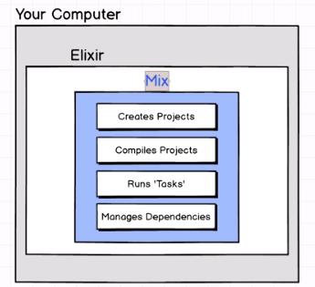
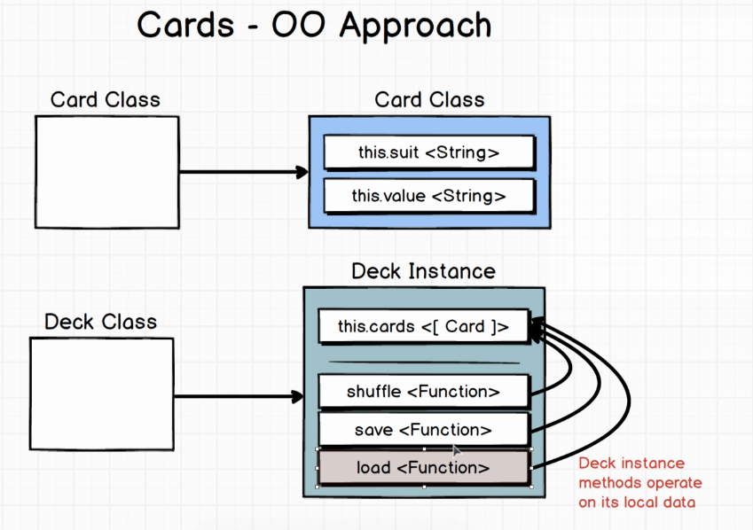
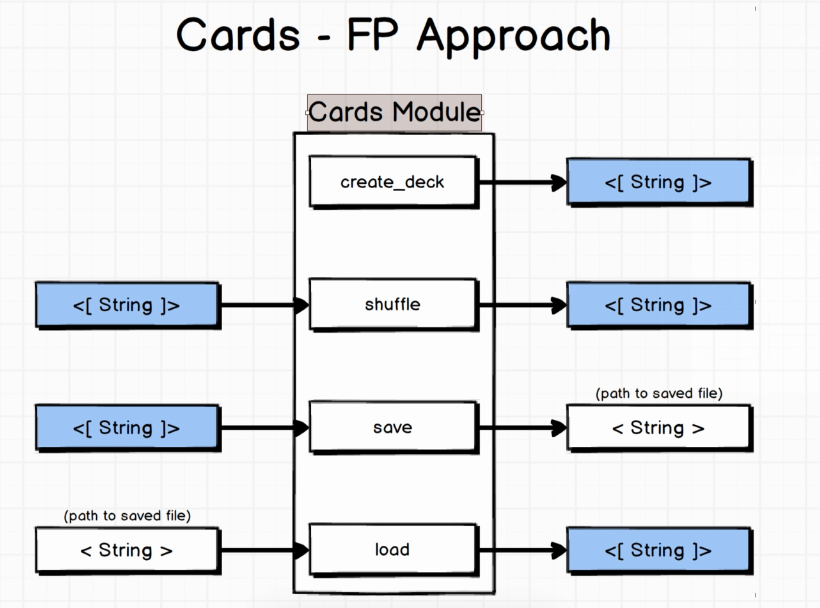

# The Complete Elixir and Phoenix Bootcamp

- Author: Stephen Grider
- URL: https://www.udemy.com/course/the-complete-elixir-and-phoenix-bootcamp-and-tutorial

-   
- Examples of Tasks:
  - generating docs for a project
  - running tests
- Elixir has implicit return (last value)
  ```elixir
    def hello do
      "hi there"
    end
  ```
- `iex -S mix` (?)
- Use `recompile` to reload the module in `iex` after modification
- Functional programming
  - fns always return object (return "Ace")- instead of mutating an obj (self.cards = cards)
  - 
  -   
    - No concept of instance variables
    - create_deck - Return array of strings
