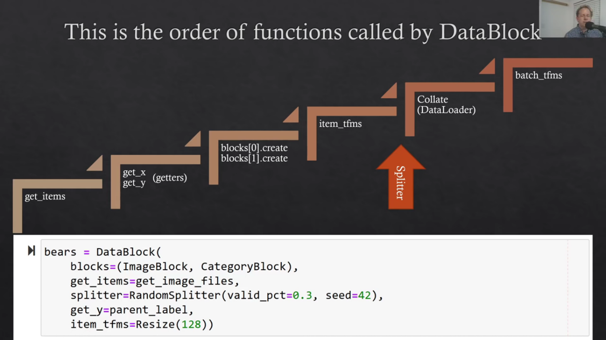
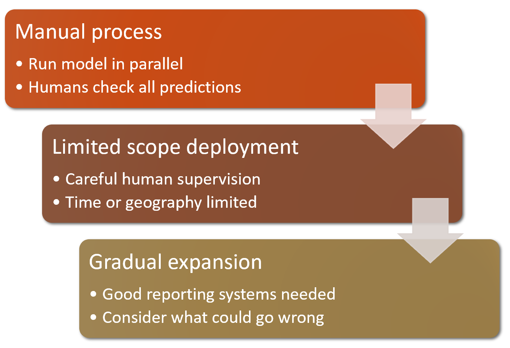
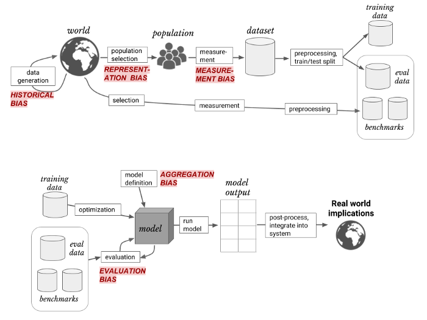
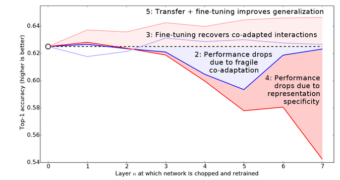

# Fastai
- Author: Jeremy Howard, Rachel
- URL: https://course.fast.ai/
- Book: https://github.com/fastai/fastbook

# Lesson 1
-  **Metric**: A metric is a function that measures the quality of the model's predictions using the validation set.
-  **Metric vs Loss**: The purpose of loss is to define a "measure of performance" that the training system can use to update weights automatically (easy for stochastic gradient descent to use). Metrics are for humans- it's easy to understand, and is close to what you want the model to do.
   - "You need a fn where if yu change the params a little bit, you need to know if your model gets a little bit better or a little bit worse. Some of these **changes are so subtle that it won't change any of the predictions** and so the metric would remain the same- but the loss would definitely change"
   -  
-  **Model**: The combination of the architecture with a particular set of parameters
-  
- The architecture only describes a *template* for a mathematical function
- fastai has both `fit` and `finetune`
- `finetune`
  1. Use one epoch to fit just the head to work correctly with your dataset.
  1. Use the number of epochs requested when calling the method to fit the entire model
- Pretrained models are not widely available for any tabular modeling tasks, although some organizations have created them for internal use
- Tip: start by using one of the cut-down versions of the dataset and later scale up to the full-size version 
- If a model makes an accurate prediction for a data item, **that should be because it has learned characteristics of that kind of item**, and not because the model has been shaped by actually having seen that particular item.
- Why do we need test datasets?
  - We, as modelers, are evaluating the model by looking at predictions on the validation data when we decide to explore new hyperparameter values! So subsequent versions of the model are, indirectly, shaped by us having seen the validation data. Just as the automatic training process is in danger of overfitting the training data, we are in danger of overfitting the validation data through human trial and error and exploration.
  - training data is fully exposed, the validation data is less exposed, and test data is totally hidden.
  - "There is a point where your validation loss could be getting worse but your val metric(acc / error) is getting better.. So the important point to detect is your **metric** getting worse, not your **loss** getting worse"

### Hiring third parties
- This same discipline can be critical if you intend to hire a third party to perform modeling work on your behalf.
-  if you're considering bringing in an external vendor or service, make sure that you hold out some test data that the vendor never gets to see. Then you check their model on your test data, using a metric that you choose based on what actually matters to you in practice, and you decide what level of performance is adequate. 
-  It's also a good idea for you to try out some simple baseline yourself, so you know what a really simple model can achiev


### Splitting data

- a key property of the validation and test sets is that they must be representative of the new data you will see in the future

- random split may not always be a good choice

- For TS problems, choose a continuous section with the latest dates (last 2 weeks or last month of available data) as your validation set

- Distracted driver competition had photos of drivers in the test set who never appeared in the training set

# Lesson 2

## Lecture notes
- DL isnt good for generating accurate information- but its goiod at generating things that sound accurate. We currently don't have great ways to make sure they're correct

- How do we decide if there is a relationship?
  - Start with a null hypothesis ("There's no relationship")
  - Gather data of dependent and independent variables
  - What percent of time do we see this(which?) relationship by chance? 
    - There's a simple equation we can use for this
  - Here's the thing
    - p-values are terrible [American Statistical Association](https://www.amstat.org/asa/files/pdfs/P-ValueStatement.pdf)
      1. P-values can indicate how incompatible the data are with a specified statistical model.
      2. 2.P-values do not measure the probability that the studied hypothesis is true, or the probability that the data were produced by random chance alone. 
         1. J: "As you can see when we collected data from 3000 cities, p-values were much lower"
      3. Scientific conclusions and business or policy decisions should not be based only on whether a p-value passes a specific threshold.
      4. Proper inference requires full reporting and transparency.
      5. A p-value, or statistical significance, does not measure the size of an effect or the importance of a result.
      6. By itself, a p-value does not provide a good measure of evidence regarding a model or hypothesis
   - J: **"I've shown you this so you know why they don't work- not so that you can use them"** 
   - What if you picked the opposite hypothesis? "There is a relationship"
     - Do I have enough data to reject that hyp?
   - Univatiate vs Multivariate
     - If you look at just univariate models (one independent var vs one dependent var), there might not seem like there;s a relationship
     - But if you look at multivariate models, there might be enough significance for the same variables (temp and humidity in this case)
     - Why?
       - Denser cities are going to have more transmission
       - More humid might mean less transmission
       - When you do a multivariate model, it allows you to be more confident about your results
   - p-value still does not tell us whther this is of practical importance
   - The thing that does tell us this is the slope
     - Change the value of temp and humidity and see the effect on output
       - In this case, temp = 35, rel hum = 40 yielded R < 0.8 (no transmission of disease)
       - But if we plug in 10, 15, then there's a massive explosion of disease (R>2)
   - [Designing great data products - Jeremy Howard](https://www.oreilly.com/radar/drivetrain-approach-data-products/)
   - Autocorrelated
     - Places that are close to each other geographically have similar temp and humidit
     - So you cant think of these as separate cities, because the ones close to each other have similar behaviour
   - Consider utiilty: What would be the economic and social implications 
       - No real relationship, Act as if there was
       - No real relationship, Don't act as if there was
       - Is real relationship, Act as if there was
       - Is real relationship, Don't act as if there was
   - Priors
     - Flu virus dies at 27 deg C
     - Other coronaviruses are seasonal
     - 1918 flu was seasonal
     - Climate relationship seen in every country and city studied (?)
     - All this might let us conclude Covid is seasonal

  


## Notes - Chapter 2

### References
- [Designing great data products](https://www.oreilly.com/radar/drivetrain-approach-data-products/)
- [RAPIDS](https://rapids.ai/)
- [Actionable Auditing - Investigating the Impact of Publicly Naming Biased Performance Results of Commercial AI Products](https://sci-hub.do/https://doi.org/10.1145/3306618.3314244)
- [To Predict and serve?](https://rss.onlinelibrary.wiley.com/doi/full/10.1111/j.1740-9713.2016.00960.x)
### Starting your project
-  When selecting a project, the most important consideration is data availability. 
-  Many researchers, and industry practitioners waste time attempting to find their perfect dataset. **The goal is not to find the "perfect" dataset or project, but just to get started and iterate from there.**
-  We also suggest that you iterate from end to end in your project; that is, don't spend months fine-tuning your model, or polishing the perfect GUI, or labelling the perfect dataset… Instead, **complete every step as well as you can in a reasonable amount of time, all the way to the end.**
-  By completing the project end to end, you will see where the trickiest bits are, and which bits make the biggest difference to the final result.

- In an organizational context show your idea can really work by **showing them a real working prototype**. This is the secret to getting **good organizational buy-in** for a project.
- Even if you can't find the exact data you need for the precise project you have in mind, you might be able to find something from a similar domain, or measured in a different way, tackling a slightly different problem.
- Working on these kinds of **similar projects** will still give you a **good understanding of the overall process, and may help you identify other shortcuts, data sources**, and so forth.

### State of the art
#### Vision
- Deep learning algorithms are generally not good at recognizing images that are significantly different in structure or style to those used to train the model.
  - Color vs B/W
  - Photo vs Drawing
  - **These are called "out-of-domain" data**
- Although your problem might not look like a computer vision problem, it might be possible with a little imagination to turn it into one.

#### NLP
- Deep learning is also very good at generating context-appropriate text, such as replies to social media posts, and imitating a particular author's style. 
- We **don't currently have a reliable way to combine a knowledge base of medical information with a deep learning model** for generating medically correct natural language responses.
- **Translation or summary could well include completely incorrect information**!

#### Combining text and images
- We generally recommend that deep learning be used not as an entirely automated process, but as part of a process in which the model and a human user interact closely. 
  - an automatic system can be used to identify potential stroke victims directly from CT scans, and send a high-priority alert to have those scans looked at quickly. 
  - automatically measure items seen on the scans, and insert those measurements into reports, warning the radiologists about findings that they may have missed, and telling them about other cases that might be relevant.
  
#### Tabular data
- If you already have a system that is using random forests or gradient boosting machines then switching to or adding deep learning may not result in any dramatic improvement.
- Deep learning does greatly increase the variety of columns that you can include
  - columns containing natural language (book titles, reviews, etc.)
  -  high-cardinality categorical columns (zip code or product ID)
-  deep learning models generally take longer to train than random forests or gradient boosting machines

#### Recommendation systems
- Recommendation systems are really just a special type of tabular data.
  - high-cardinality categorical variable representing users, and another one representing products (or something similar)
- DL helps combining these variables with other kinds of data, such as natural language or images, and additional metadata represented as tables, such as user information, previous transactions etc.
- However, nearly all machine learning approaches have the **downside that they only tell you what products a particular user might like, rather than what recommendations would be helpful** for a user

### Drivetrain approach
- We use data not just to generate more data but to produce **actionable outcomes**. That is the goal of the Drivetrain Approach. 
1.  Start by defining a clear objective.
      - Eg. Google: "What is the user’s main objective in typing in a search query?"
      - Answer: "show the most relevant search result."
2.  The next step is to consider what levers you can pull (i.e., what actions you can take) to better achieve that objective.
      - In Google's case, that was the ranking of the search results.
3. The third step was to consider what new data they would need to produce such a ranking;
     - implicit information regarding which pages linked to which other pages could be used for this purpose.
4. **Only after these first three steps do we begin thinking about building the predictive models**. 
- Our objective and available levers, what data we already have and what additional data we will need to collect, determine the models we can build.
- > Let's consider another example: recommendation systems. The objective of a recommendation engine is to drive additional sales by surprising and delighting the customer with recommendations of items they would not have purchased without the recommendation. The lever is the ranking of the recommendations. New data must be collected to generate recommendations that will cause new sales. This will require conducting many randomized experiments in order to collect data about a wide range of recommendations for a wide range of customers. This is a step that few organizations take; but without it, you don't have the information you need to actually optimize recommendations based on your true objective (more sales!).
- Another example: You could build two models for purchase probabilities, conditional on seeing or not seeing a recommendation.
  -  **The difference between these two probabilities is a utility function for a given recommendation to a customer.**
  -  It will be low in cases where the algorithm recommends a familiar book that the customer has already rejected (both components are small) or a book that they would have bought even without the recommendation (both components are large and cancel each other out).

### Gathering data

- To turn our downloaded data into a DataLoaders object we need to tell fastai at least four things:
  1. What kinds of data we are working with
     ```py 
     blocks=(ImageBlock, CategoryBlock)
     ```
     - independent variables are images, dependent variables are the categories
  2. How to get the list of items
     ```py
     get_items=get_image_files
     ```
  4. How to label these items
     ```py
     get_y=parent_label
     ```
  5. How to create the validation set
      ```py
      splitter=RandomSplitter(valid_pct=0.2, seed=42)
      ```
- Our images are all different sizes, and this is a problem for deep learning: we don't feed the model one image at a time but several of them (what we call a mini-batch). 
- To group them in a big array (usually called a tensor) that is going to go through our model, they all need to be of the same size. 
- So, we need to add a transform which will resize these images to the same size. 
- `Item transforms` are pieces of code that run on each individual item

```py
bears = DataBlock(
    blocks=(ImageBlock, CategoryBlock), 
    get_items=get_image_files, 
    splitter=RandomSplitter(valid_pct=0.2, seed=42),
    get_y=parent_label,
    item_tfms=Resize(128))
```

- This command has given us a DataBlock object. **This is like a template for creating a `DataLoaders`.** We still need to tell fastai the actual source of our data—in this case, the path where the images can be found.

- `DataLoader` is a class that provides batches of a few items at a time to the GPU. 
- `DataLoaders` includes validation and training `DataLoader`s. 
- When you loop through a `DataLoader` fastai will give you 64 (by default) items at a time, all stacked up into a single tensor.

- Image augmentation
  - If we squish or stretch the images they end up as unrealistic shapes, model learns that things look different to how they actually are, resulting in lower accuracy. 
  - If we crop the images, we remove some of the features that allow us to perform recognition. eg. a key part of the body or the face necessary to distinguish between similar breeds. 
  - If we pad the images then we empty space, which is just wasted computation for our model, results in a lower effective resolution for the part of the image we actually use.
  - Instead, on each epoch randomly crop a different part of each image. Now  our **model can learn to focus** on, and recognize, different features in our images. 
  - If all the images are of the same size, we can apply these augmentations to an entire batch of them using the GPU, which will save a lot of time.
  - The intuitive approach to doing data cleaning is to do it before you train a model. But **a model can actually help you find data issues more quickly and easily**. So, we normally prefer to train a quick and simple model first, and then use it to help us with data cleaning.
  - Photos that people are most likely to upload to the internet are the kinds of photos that do a good job of clearly and artistically displaying their subject matter—which isn't the kind of input this system is going to be getting.
- **Domain shift**: the type of data that our model sees changes over time. For instance, an insurance company's pricing and risk algorithm- over time the types of customers that the company attracts, and the types of risks they represent, may change so much that the original training data is no longer relevant.
- Rollout process
  -   
  - First step: Manual process 
    - use an entirely manual process, with your deep learning model approach running in parallel but **not being used directly to drive any actions**
    - The humans involved in the manual process should look at the deep learning outputs and check whether they make sense
  - Second step: limit the scope of the model, and have it carefully supervised by people. 
    - Do a small geographically and time-constrained trial of the model-driven approach. 
    - pick a single observation post, for a one-week period, and have a someone check each alert before it goes out.
  - Thrid step: Gradually increase the scope of your rollout. 
    - Ensure to have good reporting systems in place, to make sure that you are aware of any significant changes to the actions being taken compared to your manual process. 
    - If the number of bear alerts doubles or halves after rollout of the new system in some location, we should be very concerned. 
    - Try to think about all the ways in which your system could go wrong, and then **think about what measure or report or picture could reflect that problem, and ensure that your regular reporting includes that information.**


### Unforeseen Consequences and Feedback Loops¶
- A helpful exercise prior to rolling out a significant machine learning system is to consider this question: **"What would happen if it went really, really well?"** In other words, what if the predictive power was extremely high, and its ability to influence behavior was extremely significant? In that case, who would be most impacted? **What would the most extreme results potentially look like?** How would you know what was really going on?
- **Of course, human oversight isn't useful if it isn't listened to, so make sure that there are reliable and resilient communication channels so that the right people will be aware of issues, and will have the power to fix them.**
- You risk not having a feedback loop any time your model is potentially driving the next round of data
- The people involved in the model oversight need to be involved in product and engineering, not siloed into a "Trust and Safety" team
- > You are best positioned to **help people one step behind you**. The material is still fresh in your mind. Many experts have forgotten what it was like to be a beginner (or an intermediate) and have **forgotten why the topic is hard to understand when you first hear it**. The context of your particular background, your particular style, and your knowledge level will give a different twist to what you’re writing about.

- You almost certainly do not need a GPU to serve your model in production. There are a few reasons for this:

    - GPUs are only useful when they do lots of identical work in parallel.
    - An alternative could be to wait for a few users to submit their images, and then batch them up and process them all at once on a GPU. Users then have to wait, rather than getting answers straight away! And you **need a high-volume site for this to be workable**. If you do need this functionality, you can use a tool such as **Microsoft's ONNX Runtime, or AWS Sagemaker**
    - The complexities of dealing with GPU inference are significant. In particular, the GPU's memory will need careful manual management, and you'll need a careful queueing system to ensure you only process one batch at a time.
    - There's a lot more market competition in CPU than GPU servers, as a result of which there are much cheaper options available for CPU servers.


# Lesson 3
- `RandomResizedCrop` 
  - crops randomly on training set
  - crops center on validation set
- Other batch transforms only does augmentation on training set. Leaves val set untouched.
- Why are images cropped to squares?
  - Only because there are variations in image sizes in dataset
  - If its one size, then its okay to not have squares
  - Else you can choose images in each mini batches according to their sizes and decide what the best image size for each minibatch is
- `learner_inf.predict` will give you confidences in the order of `learner.dls.vocab`. 
  - `learner_inf = load_learner(...)`  will auto load the dls too within learner
- Create a model that will work on a smaller subset of your data before working on the whole dataset
  - This means fewer classes and fewer data points
- Set 'Path.BASE_PATH` so that you don't have to see all the trailing slashes
- Start with a stupid simple model
  - Always predict the mean- see what accuracy you get

- Pytorch
  - `tns.type()` (tensor.LongTensor) is different from `type(tns)` (torch.Tensor)

## Notes - Chapter 3

- We will learn
  - the roles of arrays and tensors and of broadcasting, 
  - explain stochastic gradient descent (SGD),
  - choice of a loss function for basic classification
  - role of mini-batches
  - math that a basic neural network is actually doing

- >**We've seen that the only consistent trait amongst every fast.ai student that's gone on to be a world-class practitioner is that they are all very tenacious.**
- Jupyter knows about PIL images, so it displays the image for us automatically.
- Strategies for Baselines 
  - think of a simple, easy-to-implement model
  - search and find other people who have solved similar problems
- **Rank**: 
  - The length of a tensor's shape 
  - number of axes or dimensions in a tensor
- **Shape**
  -  the size of each axis of a tensor

```py

>>> tensor([.1, .2, .3]).ndim
1

>>> tensor([[.1, .2, .3]]).ndim
2

>>> len(tensor([[.1, .2, .3]]).shape)
2

>>> tensor([[.1, .2, .3]]).shape
torch.Size([1, 3])

>>> tensor([[.1, .2, .3], [.1, .2, .3]]).shape
torch.Size([2, 3])
```

- Intuitively, the difference between L1 norm and mean squared error (MSE) is that the latter will penalize bigger mistakes more heavily than the former (and be more lenient with small mistakes).

-  **`fastai` adds some features to NumPy and PyTorch to make them a bit more similar to each other. **

- **jagged array**: innermost arrays potentially being different sizes

```py
# Jagged array 
>>> np.array([np.ones(2), np.ones(3)])
array([array([1., 1.]), array([1., 1., 1.])], dtype=object)
```
- a PyTorch tensor cannot be jagged. It is always a regularly shaped multidimensional rectangular structure.

- As a metric, we could use either mean squared error, or mean absolute error, and take the average of them over the whole dataset. However, neither of these are numbers that are very understandable to most people; in practice, we normally use accuracy as the metric for classification models.

- > We already had a metric, which was overall accuracy. So why did we define a loss? The key difference is that **the metric is to drive human understanding and the loss is to drive automated learning**. 
- > To drive automated learning, **the loss must be a function that has a meaningful derivative**. It **can't have big flat sections and large jumps**, but instead must be reasonably smooth. This is why we designed a loss function that would respond to small changes in confidence level. This requirement means that sometimes it does not really reflect exactly what we are trying to achieve, but is rather a compromise between our real goal, and a function that can be optimized using its gradient. The loss function is calculated for each item in our dataset, and then at the end of an epoch the loss values are all averaged and the overall mean is reported for the epoch.

- > As we've discussed, we want to calculate our metric over a validation set. This is so that we don't inadvertently overfit—that is, train a model to work well only on our training data. This is not really a risk with the pixel similarity model we're using here as a first try, **since it has no trained components**
- It's good to get in the habit of checking shapes as you go.
- `batch_tfms` needs all images to be of the same size. It runs on a whole batch, in the GPU. `item_tfms` is a previous step that ensures that size consistency, and it runs on the CPU.
- >It’s best to retrain your model regularly, on a mix of new and old data. What percentage of which depends on your problems: bears don’t change so you probably want everything, but if your data could shift, you probably want some mix like 80-90% new and 20-10% old. (sgugger)[https://forums.fast.ai/t/lesson-3-official-topic/67244/99?u=niazangels]
- **Broadcasting**:  automatically expand the tensor with the smaller rank to have the same size as the one with the larger rank.
- `mean((-1,-2))`: Take mean over the last two axes. We are left with just the first tensor axis, which indexes over our images, which is why our final size was `(1010)`
- `tensor.requires_grad_` : tells PyTorch that we want to calculate gradients with respect to that variable at that value
- The PyTorch API also puts the focus on the **argument**, not the function you're actually computing the gradients of. It may feel backwards at first, but it's just a different perspective.
- >  Life would probably be easier if `backward` was just called `calculate_grad`

```py
>>> xt = tensor([1., 2., 3.]).requires_grad_()
>>> def f(x):
    ... return (x**2)
>>> yt = f(xt)
>>> yt.backward()

RuntimeError: grad can be implicitly created only for scalar outputs
```

- "stepping your parameters": using an optimizer step. (`w -= gradient(w) * lr`)

# Lesson 4

- **Parameters**: Weights + biases
- Some metrics have a nicely defined gradient and can be directly used as a loss - eg. MSE, but not for classification
- Why not use median instead of mean for loss, since its less prone to influence by outlier? 
  - Median pretty much focuses on one number, and ignores the rest
  - In fact all that it cares abt is the order of things
  - So J's guess is it'll only be good at predicting one thing in the middle
  - Middle would also give you zero gradient at some point- just J's guess

- fastai `DataLoader` holds batched data from dataset
- `nn.ReLU` is a class. `F.relu` is a fn.
- Won't a RelU create all zeros in case of a negative matrix? Won't this cause zero grads and stop training?
  - Yes, but there wont be zeros for every image
  - And in a mini batch, we shuffle every time we create a new epoch
  - And so even if its zero for one minibatch, it wont be for the next mini batch
  - Also this is where leaky RelUs help
  - Even better is to init the weights to sensible values and step by sensible amounts (so it stays positive)
  - We will also see how to analyze inside these networks to see how many dead neurons we have: they are bad and do not do any work
  - `learn.model` contains the actual model obj
```py
m = learn.model
w, b = m[0].parameters()
show_image(w[0].view(28, 28))
# J: We might have far more filters than we need - which is why some of the visualizations are not that obvious
```
> J: "There are many non linearities to choose from and it generally doesnt matter which one, so just choose relu / any one.

## Notes - Chapter 5

- Each zoom/warp/resize will need an interpolation step which is not just slow by also lower the quality of the image
- fastai does all the co-ord transformation and apply it only once to do the interpolation
- `datablock.summary(path/'images')`, tells you everything that was happening
- J: We recommend creaing a model as soon as you can- even before cleaning the data. Your model can teach you about the problems in your data.
- fastai will automatically pick a reasonable loss fn for you. See `learn.loss_func`
- `dls.one_batch()` is equivalent to `first(dls.train)`
- `F.nll_loss` confusingly does not do a log.
  - its more convenient to take the log at the softmax step


## Notes - Lesson 5 - Data Ethics

- **Feedback loop**: Occurs whenever the model controls the next round of data you get. The data that is returned quickly becomes flawed by the model itself.
- Common issue: Systems implemented with no way to identify and address mistakes
- Facebook - if you change the picture in the ad from a white family to a black family, it gets served to very different audiences
- Deepglint
  - https://www.youtube.com/watch?v=xhp47v5OBXQ
  - https://www.youtube.com/watch?v=C7AkwHvldBY
- Much of AI/ML centers on optimizing a metric.   Overempahsizing metrics leads to 
  - Manipulation
  - Gaming
  - Mypoic focus on short term goals
  - Unexpected negative consequences

- > "Platforms are structurally at war with themselves- Outrageous, offensive content is exactly what goes viral."
- Major tech platforms unintentionally incentivize and promote disinformation by
  - Their design and architecture
  - Their recommendation system
  - Their business models
- Hockeystick growth relies on automation and a reliance on metrics
  - Priotitizing speed above all else does not leave 
- The problem with biased data - Harini Suresh: https://medium.com/@harinisuresh/the-problem-with-biased-data-5700005e514c
- Questions to ask about AI
  - Should we even be doing this?
  - What is the bias in the data?
    - All data is biased
    - Datasheet for datasets
  - Can the code and data be audited?
  - What are the error rates for different sub groups?
    - light vs dark , men vs women, dark-women vs light-men
  - What is the accuracy of a simple rule based alternative?
  - What process are in place to handle appeals or mistakes?
  - How diverse is the team that built it?
  - Consequentialist Questions
    - Who will be directly affected by this project? Who will be indirectly affected?
    - Will the effects in aggregate likely create more good than harm, and what types of good and harm?
    - Are we thinking about all relevant types of harm/benefit (psychological, political, environmental, moral, cognitive, emotional, institutional, cultural)?
    - How might future generations be affected by this project?
    - Do the risks of harm from this project fall disproportionately on the least powerful in society? Will the benefits go disproportionately to the well-off?
    - Have we adequately considered "dual-use"?

- ### Tool 1: Ethical Risk Sweeping
- Institute regularly scheduled ethical risk sweeping practices
- Treat it like cybersec - "No vuln found" is a good outcome, but its not wasted effort- you **keep doing it**
- **Assume you missed some risks** in the initial project development phase- and **reward team members** for spotting new ethical risks
### @niazangels: Where's Tool 2?
### Tool 3: Expanding the Ethical Circle
- Whose interests, desires, skills, experiences and values have we simply assumed, rather than actually consulted?
- Who are all the stakeholders who will be directly affected by our product? How have their interests been protected? How do we know what their interests really are? Have we asked?

### Tool 6: Think about terrible people
  - Who will want to abuse, steal, misinterpret, hack, destroy, or weaponize what we built?
  - Who will use it with alarming stupidity/irrationality?
  - What rewards/incentives/openings has our design inadvertantly created for those people?
  - How can we remove those rewards or incentives?
### Tool 7: Closing the loop: Ethical Feedback and iteration
  - Remember that the ethical design/engineering is never a finished task
  - Identify feedback channels that will deliver reliable data on ethical impact
  - Integrate the process w/ quality manangement and user input
  - Develop formal procedures and chains of responsibility for ethical iteration

---

- If product managers, engineers and visionaries cared about this stuff, you wouldn't need a trust and safety team. It would be built into the product.
- **If you're looking for a job, look for companies where founders have a background similar to you** 

- 
  - Blog: https://medium.com/@harinisuresh/the-problem-with-biased-data-5700005e514c
  - Paper: https://arxiv.org/pdf/1901.10002.pdf
  > An engineer building a smiling-detection system observes that the system has a higher false negative rate for women. Over the next week, she collects many more images of women, so that the proportions of men and women are now equal, and is happy to see the performance on the female subset improve.

  > Meanwhile, her co-worker has a dataset of job candidates and human-assigned ratings, and wants to build an algorithm for predicting the suitability of a candidate. He notices that women are much less likely to be predicted as suitable candidates than men. Inspired by his colleague’s success, he collects many more samples of women, but is dismayed to see that his model’s behavior does not change.

  > Why did this happen? The sources of the disparate performance in either case were different: **In the first case, it arose because of a lack of data on women**, and introducing more data solved the issue. 
  
  >**In the second case, the use of a proxy label (human assessment of quality) versus the true label (actual qualification) allowed the model to discriminate** by gender, and collecting more labelled data from the same distribution did not help.
  >   

  > **Historical bias** arises when there is a misalignment between world as it is and the values or objectives to be encoded and propagated in a model. It is a normative concern with the state of the world, and exists even given perfect sampling and feature selection.
  >  - When doctors were shown identical files, they were much less likely to recommend cardiac catheterization (a helpful procedure) to Black patients.
 >  - When bargaining for a used car, Black people were offered initial prices $700 higher and received far smaller concessions.
 >  - Responding to apartment rental ads on Craigslist with a Black name elicited fewer responses than with a white name.
 >  - An all-white jury was 16 percentage points more likely to convict a Black defendant than a white one, but when a jury had one Black member it convicted both at the same rate.


  > **Representation bias** arises while defining and sampling a development population. It occurs when the development population under-represents, and subsequently causes worse performance, for some part of the final population.
  
  > **Measurement bias** arises when choosing and measuring the particular features and labels of interest. Features considered to be relevant to the outcome are chosen, but these can be incomplete or contain group- or input-dependent noise. In many cases, the choice of a single label to create a classification task may be an oversimplification that more accurately measures the true outcome of interest for certain groups.
  
  > **Evaluation bias** occurs during model iteration and evaluation, when the testing or external benchmark populations do not equally represent the various parts of the final population. Evaluation bias can also arise from the use of performance metrics that are not granular or comprehensive enough.
  
  > **Aggregation bias** arises when flawed assumptions about the population affect model definition. In many applications, the population of interest is heterogeneous and a single model is unlikely to suit all subgroups.

  > As an ML practitioner, knowledge of an application can and should inform the identification of bias sources. Issues that arise in image recognition, for example, are often related to selection or evaluation bias since large publicly-available image datasets frequently do not equally represent the entire space of images that we care about. In data that is affected by human decision-makers, we often see human decisions used as proxies, introducing measurement bias. **For example, “arrested” is used as a proxy for “crime,” or “pain medication prescribed by doctor” is used as a proxy for “patient’s pain.”** Identifying aggregation bias usually requires an understanding of meaningful groups and reason to think they are distributed differently. Medical applications, for example, often risk aggregation bias because patients with similar underlying conditions present and progress in different ways. Recognizing historical bias requires a retrospective understanding of the application and data generation process over time.
  
  > - Understand “bias” in ML at the right level of abstraction to facilitate more productive communication and development of solutions. 
  > - Terms such as “training data bias” are too broad to be useful
  > - Encourage application-appropriate solutions rather than relying on broad notions of what is fair

  ## Notes - Chapter 3

  - > Sometimes, the right response to being asked to do a piece of work is to just say "no." Often, however, the response we hear is, "**If I don’t do it, someone else will.**" But consider this: if you’ve been picked for the job, you’re the best person they’ve found to do it—so **if you don’t do it, the best person isn’t working on that project.** If the first five people they ask all say no too, even better!

- Four points
  - Recourse and Accountability
  - Feedback loops
  - Bias
  - Disinformation

### Recourse and Accountability
- Bureaucracy has often been used to shift or evade responsibility
- Mechanisms for audits and error correction are crucial. In some existing systems, there are no process in place for correcting mistakes or removing people once they’d been added

### Feedback Loops
- YouTube's recommendation algorithm had begun curating playlists for pedophiles, picking out innocent home videos that happened to contain prepubescent, partially clothed children. Same for conspiracy theories.

- Part of the problem here is the centrality of metrics in driving a financially important system. **When an algorithm has a metric to optimize, as you have seen, it will do everything it can to optimize that number.** This tends to lead to all kinds of edge cases, and humans interacting with a system will search for, find, and exploit these edge cases and feedback loops for their advantage.

### Disinformation

- It is not necessarily about getting someone to believe something false, but rather often used to **sow disharmony and uncertainty**, and to get people to give up on seeking the truth. Receiving conflicting accounts **can lead people to assume that they can never know** whom or what to trust.

- disinformation can often contain seeds of truth, or half-truths taken out of context. 

# Notes - Chapter 5
- `RandomResizedCrop` will be added for you if you include the `min_scale` parameter in your aug_transforms 
- `dls.show_batch(*max_n=16)`
- Once you think your data looks right, we generally recommend the next step should be using it to train a simple model. 
- **We often see people put off the training of an actual model for far too long. **
- The exponential also has a nice property: if one of the numbers in our activations x is slightly bigger than the others, the exponential will amplify this (since it grows, well... exponentially), which means that in the softmax, that number will be closer to 1.
- Softmax fn really wants to pick one class among the others, so it's ideal for training a classifier when we know each picture has a definite label 
**- During inference you might want your model to sometimes tell you it doesn't recognize any of the classes** that it has seen during training, and not pick a class because it has a slightly bigger activation score. In this case, it might be better to **train a model using multiple binary output columns**, each using a sigmoid activation.

- With log, multiplication, which can create huge and tiny numbers, can be replaced by addition, which is much less likely to result in overflow/underflow.
- Despite its name, `F.nll_loss` does not take the log. **It assumes that you already took the log of the softmax.**
- PyTorch has a function called `log_softmax` that combines `log` and `softmax` in a fast and accurate way. `nll_loss` is designed to be used after `log_softmax`
- `nn.CrossEntropyLoss` actually does `log_softmax` and then `nll_loss`
- By default PyTorch loss functions take the mean of the loss of all items. You can use `reduction='none'` to disable that: `nn.CrossEntropyLoss(reduction='none')(acts, targs)`
- The gradient of `cross_entropy(a,b)` is just `softmax(a)-b`. Since `softmax(a)` is just the final activation of the model, that means that the gradient is proportional to the difference between the prediction and the target.
  - This is the same as mean squared error in regression (assuming there's no final activation function such as a limiter), since the gradient of `(a-b)**2` is `2*(a-b)`. 
  - Because the gradient is linear, we won't see sudden jumps in gradients, which should lead to smoother training of models.
- When we call the `fine_tune` method fastai does two things:
    - Trains the randomly added layers for one epoch, with all other layers frozen
    - Unfreezes all of the layers, and trains them all for the number of epochs requested
-   
- `fastai` lets you pass a Python `slice` object anywhere that a learning rate is expected. 
  - `(earliest_layer_lr, final_layer_lr)` 
  - The layers in between will have learning rates that are multiplicatively equidistant throughout that range.
- Overfitting: val loss starts increasing
  - But this **does not mean that it is getting less accurate**, necessarily.
  - You will often see that the training accuracy continues improving
- > On the other hand, you may well see that the metrics you have chosen are really getting worse at the end of training. Remember, it's **not just that we're looking for the validation loss to get worse, but the actual metrics**. Your validation loss will first get worse during training because the model gets overconfident, and only later will get worse because it is incorrectly memorizing the data. We only care in practice about the latter issue. **Remember, our loss function is just something that we use to allow our optimizer to have something it can differentiate and optimize; it's not actually the thing we care about in practice.**
- > Before the days of 1cycle training it was very common to save the model at the end of each epoch, and then select whichever model had the best accuracy out of all of the models saved in each epoch. This is known as early stopping. However, this is very unlikely to give you the best answer, because those epochs in the middle occur before the learning rate has had a chance to reach the small values, where it can really find the best result. **Therefore, if you find that you have overfit, what you should actually do is retrain your model from scratch, and this time select a total number of epochs based on where your previous best results were found.**
- A bigger model has the ability to better capture the real underlying relationships in your data, and also to capture and memorize the specific details of your individual images.

# Lesson 6
- Q: What is Cross entropy loss?
- How does LRfinder work? 
  - Runs through the DataLoader, picks a mini batch each time
  - Each mini batch is trained with a little bigger LR
  - Plot all LRs
  - lr_min = lr_at_min_loss / 10, lr_steep = lr_at_most_change
- `cnn_learner` freezes the model for us, so we dont have to do it ourselves
- `fit_one_cycle` increases lr to lr_max for the first 1/3 of the batches and then reduces for the next 2/3rds
- If your model performance overshoots with `fit_one_cycle`, say 8th epoch had better performance than 12th epoch, then
  - Change the epochs in `fit_one_cycle` to 8
  - Now you'll have a low lr at epoch 8 and have generally better performance than before
- The `metric` and `val_loss` may not always be in lockstep (moving together)
- `Learner.to_fp16` can switch models to half precision and make training 2x-3x faster
  - You can also switch to a bigger model and have it train in the same time as a smaller model with full precision
- A `DataLoader` takes in a dataset. 
- A dataset is anything that can be indexed into and has a len
  - Often each item in a dataset is an (input, output) pair
- **Tip: **`zip(*b)` is used often to transpose `b`
- `Datasets` contain a training `Dataset` and a validation `Dataset`

```py 
dss = Dataset(filenames, [[ops_for_getting_x], [ops_for_getting_y]])
dls = DataLoaders.from_dsets(dss, batch_size=64)
```
- You don't normally have to do this yourself. The `DataBlock` does this for you.

```py
>>> dblock = DataBlock()
>>> dsets = dblock.datasets(df)
>>> len(dsets.train), len(dsets.valid)
80, 20
>>> x, y = dsets[0]
```
In the absence of transforms, the dataset returns the same row twice as x and y

```py
dblock = DataBlock(get_x=lambda x: Image.open(x['fname']), 
                  get_y=lambda y: y['fname'].split[0])
```
- Note that **if you use lambdas, you can't export the `DataBlock` / `Learner`**- you have to separate these out as fns.
- Q: For `MultiCategoryBlock` why is the tensor `float`s and not `int`s since it can only be 0 or 1?
  - A: Because we're going to use a cross entropy style loss and things will be faster in the gpu if we start using floats now.

- Usually people train with higher precision and round off models to fp8 or even bool for faster inference. But training with those low precisions are a pain because of how bumpy the grads can be.

- Its okay to use the val set to pick a hyperparameter (threshold for acc) if its a smooth curve. Avoid picking a random value from a bumpy curve because you might be just lucky. 

## Multi label classification
- Zero or Multiple labels for each images
- **You can use the validation set to pick the `threshold` hyperparameter for your `accuracy_multi`**
  - You can do this because this is a smooth curve (and not bumpy, and accidental good value)

## Collaborative filtering

```py
class DotProduct(Module):
    def __init__(self, n_users, n_movies, n_factors):
        ...
        
    def forward(self, x):
        users = ...
        movies = ...
        # dim=0 is the batch, so we want to sum up dim=1
        return (users * movies).sum(dim=1)
```

# Notes - Lesson 6 - Multicat

- Some definitions
  - `Dataset`: collection that returns a tuple of `(independent, dependent)` values as a single item. They are indexable and have a set length.
  - `Dataloader`: iterator that provides a stream of mini-batches. Each minibatch contains a tuple of independent vars, and a tuple of dependent vars

- And their plurals for bringing the training and testing together
  - `Datasets`: obj containing training and testing datasets
  - `Dataloaders`: obj containing training and testing dataloaders

- It's best to build up the `DataBlock` in stages, so you can see your mistakes as you make them.
- `F.binary_cross_entropy` and its module equivalent `nn.BCELoss` calculate cross-entropy on a one-hot-encoded target, **but do not include the initial `sigmoid`**. 
  - Normally for one-hot-encoded targets you'll want `F.binary_cross_entropy_with_logits` (or `nn.BCEWithLogitsLoss`), which do both sigmoid and binary cross-entropy in a single function
- For multicat, we can't use `accuracy` - we need to use `accuracy_multi`


# Notes - Chapter 7 - Tranining a state of the art model
- > It's particularly unlikely to be the dataset that you want to do your development and prototyping in. You should aim to have an iteration speed of no more than **a couple of minutes**.
- There is an additional benefit to progressive resizing: it is another form of data augmentation. 
- Mixup requires far more epochs to train to get better accuracy, compared to other augmentation approaches we've seen
- >There's another subtle issue that Mixup deals with for us, which is that it's not actually possible with the models we've seen before for our loss to ever be perfect. The problem is that our labels are 1s and 0s, but the outputs of softmax and sigmoid can never equal 1 or 0. This means training our model pushes our activations ever closer to those values, such that the more epochs we do, the more extreme our activations become.

- > With Mixup we no longer have that problem, because our labels will only be exactly 1 or 0 if we happen to "mix" with another image of the same class. The rest of the time our labels will be a linear combination, such as the 0.7 and 0.3 we got in the church and gas station example earlier.
- Like with Mixup, you won't generally see significant improvements from label smoothing until you train more epochs. 
- 

# Notes - Chapter 8 - Collaborative filtering
- What is an embedding?
  - indexing can be represented as matrix multiplication
  - for this we need an OHE representation of the index 
  - no real underlying reason to store the one-hot-encoded vector,
  - we should just be able to index into an array directly with an integer.
  - PyTorch includes a special layer that does just this
  - derivative is identical to OHE matmul
  - this is called an embedding
  - the thing that you multiply the one-hot-encoded matrix is called the embedding matrix.
- Forcing predictions to be between 0 and 5 can improve performance. Just add sigmoid. 
  - It's actually better to have the range go a little bit over 5, so we use (0, 5.5):
  - This is because the tail ends of the input need to be infinity to predict extremes in sigmoid.
  - @niazangels: Jeremy used (0,5,5), but I used (-0.5, 5.5) and got even better results

- Weight decay
  - `loss_with_wd = loss + wd * (parameters**2).sum()`
  - But this computation is numerically unstable if you have large weights
  - However, the derivative is `parameters.grad += wd * 2 * parameters`
  - We can make `wd` twice as large, and have `parameters.grad += wd * parameters`
- 