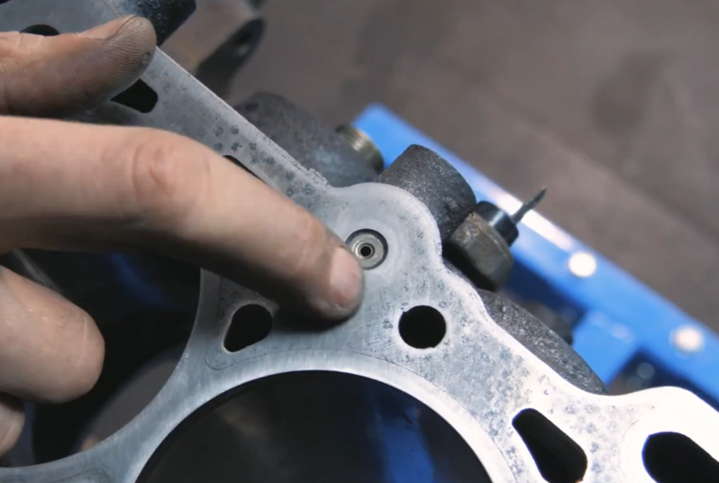
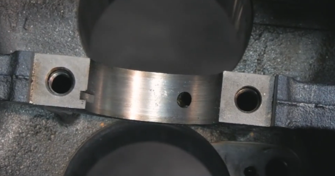
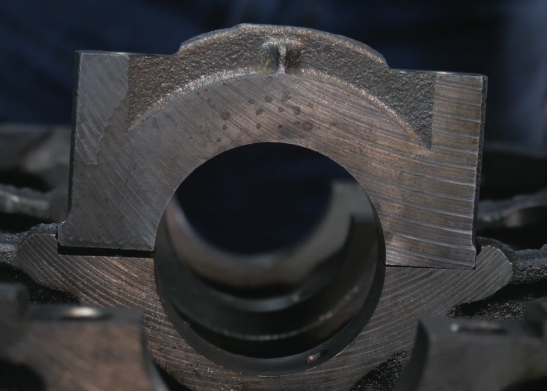
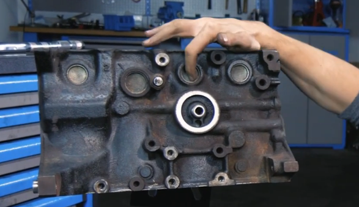
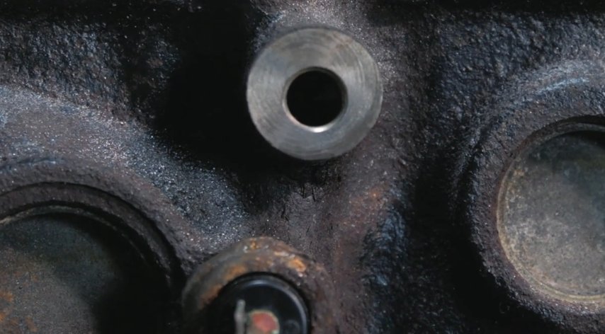

# How a car works
- Author: Alex Muir
- URL: https://howacarworks.com/
- Book: https://www.howacarworks.com/shared/howacarworks.pdf

## Engine Block
- AKA "the cylinder block", AKA "the block"
- Biggest part of the engine
- Made of cast iron, and increasingly with Aluminium lately
- Functions
  - Houses cylinders (where piston slides up and down)
  - Incorporates passageways for coolants and for oil
  - Holds accessories + auxilliary components for the engine
    - Alternator, water pump(?), starter motor, AC compressor(?)
### Construction
- Mostly Cast iron (~last 100 years)
- Early engines used individual components 
  - Network of brass pipes for oil/coolent
  - Extremely hard to mass produce, expensive, lots of parts
- Rough surface of engine block is due to sand in the moulds
- Last 20 years there's shift to Al alloys with Mg or other alloys
  - Much lighter 30% of cast Fe
- One other type
  - Billet block
    - Made for performance / restoration
    - A solid Al block is milled 
    - Super expensive
- After its cast, the important surfaces are machined 
  - Parts that are joined to other parts
  - Cylinders

### Cylinders
- In cast Fe blocks, they're machined directly into the block
- In Al alloy blocks, there are options: 
  - holes are bored and cylinder liners are inserted 
  - cylinder moulds are placed inside and Al is poured over it and Al bonds with the liner and contains the liner
  - a chemical coating (Nikasel)
- A cast Fe block is sturdy and can take the impact of the pistons
- Al is much weaker and so needs cast Fe cylinders 
- Cast Fe liners may be used to repair problems with cylinders
- Cylinders must provide minimal friction as pistons run up and down
  - Facilitated by a film of oil
- Two problems
  - We want cylinder surface to be smooth to reduce friction
  - If its too smooth, oil simply falls off the walls
- Solution
  - Provide a crosshatch pattern created with a process called "honing" 
  - 60 degree crossovers forming diamond shapes to create pools of oil

### The Deck
- Top surface of the Block
- Meets the bottom of the cylinder head
- In between this is a "gasket"
  - A gasket is a mechanical seal which fills the space between two or more mating surfaces, generally to prevent leakage from or into the joined objects while under compression. Gaskets allow for "less-than-perfect" mating surfaces on machine parts where they can fill irregularities.
- Its vital that the deck is perfectly flat so we dont have leaks
- There's enormous pressure coming from action of the pistons. Gasket takes the brunt of that pressure.
- Top surface of the deck and underside of the cylinder (?) both needs to be perfectly flat
- Cylinder head (?) can sometimes warp and might need to be machined but the deck is unlikely to be warped
- For inline 4 or inline 6, there's just a single deck.
- For V shaped/ W shaped engines, theres multiple decks. 
- If they need to be machined, they all need to be machined to the same height.

### Oil Galleries
- Oil passages inside the block
- Oil pump pumps oil from the sump into the feed pipe inside the block
- Passes through the oil filter (outside to inside of the oil filter)
- Enters the main gallery and leaves 
- From main gallery, there are passageways going up to the deck which goes up to the cylinderhead and lubricates the camshaft and the valvetrain.
  - On there is an oil pressure switch
  - The switch is triggered by low oil pressure and it flashes on warning lights
  - More advanced engines will have a pressure sensor
- From main gallery there are also little oil passageways which run down to the main journals (?) and jets which lubricate the inside of the cylinders
- On the deck there is an oil regulator which is a narrow hole which keeps the pressure in the block "nice and high, low down"
  - Its a constricted hole, so its hard for oil to get through keeping the pressure high down the passage
  - It also supplies the oil for the cylinder head
  - And once its done, the oil moves down the block through the return pipes and gets dropped back to the sump.
  -   

- Inside the engine block, the lubrication mainly happens on the underside
- Main saddles - vital to get a good supply of lubricant
  -   
- Oil also makes its way through the crankshaft
- Oil comes from main gallery, out through the holes in the saddle and into the bearings
- In the MX5, there are jets that spray the oil into the underside of the piston and thus it lubricates the underside of the piston pin and that lubricates the wrist pin of the piston or the grudgeon pin and it also keeps the piston cold and lubricates the cylinder walls.
- In other engines, the crankshaft spins and flings the oil from the sump all over the inside of the engine
- Jets were the first part @Alex bolted on, and he said "Let's torque it down with a torque wrench" after looking at the "torque specifications"
- From wikipedia
  - > A torque wrench is used where the tightness of screws and bolts is crucial. It allows the operator to set the torque applied to the fastener so it can be matched to the specifications for a particular application. This permits proper tension and loading of all parts. A torque wrench uses torque as a proxy for bolt tension.

### Crankcase
- Crankshaft sits at the bottom of the engine
- Crankcase: Bottom area of the block that holds the Crankshaft
- Main caps that clump the crankshaft into the saddle and hold the bearings should have a perfect circle
  -   
  - These are moulded as part of the block, and then bored all the way through
  - And then they are cut off and machined off at the ends
  - These go back on the the right places in order as they were formed as part of each saddle
  - You should have markings if you are taking them apart
- Sump is at the underside- usually fit with a gasket ("instantly cast adhesive gasket")

### Core plugs
- AKA Freeze plugs, AKA Expansion plugs
- Nothing to do with freezing
  - Common misconception:
    - If coolant freezes inside the block, the caps pop out
    - Maybe that would happen if the coolant froze, but you're still going to suffer serious problems and the block may still crack
- The real reason they exist is that when the block is cast, the mold is inside the block and there needs to be some way to get the sand out, and thats why the core holes exist.
- The engine is tipped and sand is poured out
- Maybe this is a bug marketted as a feature 🤣
-   

- There are also oil gallery plugs but they are much smaller
- Core plugs are thin metal
- Can corrode and leak
- Hence if the engine leaks, it's more than likely that the core plug is leaking than there being a crack on the block
- Fairly easy to replace and roughly standard size

### Other bits regarding the Block
- The block is a good place to mount the engine to the chasis - strong and can take the strain
- There will be a rubber mounting which reduces vibration
- There are also various other holes called "bosses" where the surface is machined flat to create a flush finish and the hole is tapped out to give a thread to mount things (water pump, alternator, air conditioning pump etc)
-   

### Water jackets
- We need to keep cylinders cools because if it gets too heated, there might be pre-ignition
  - Can cause all sorts of problems with stress and timings on engine components
- Also piston can expand with heat and cause wear on the cylinder via metal-metal contact
- So we need to cool from bottom up (hot coolant rises above cool coolant)
- A well designed cooling system will have no air gaps, no voids where coolant can get trapped
  - you want to be able to drain all of the coolant and not have any reservoirs of coolant
  - its the same with the oil passage.