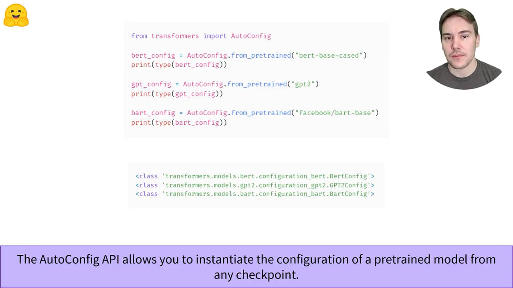
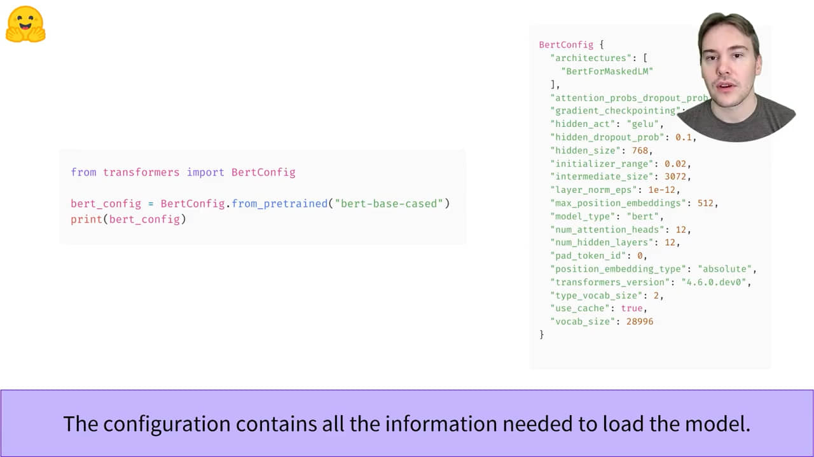
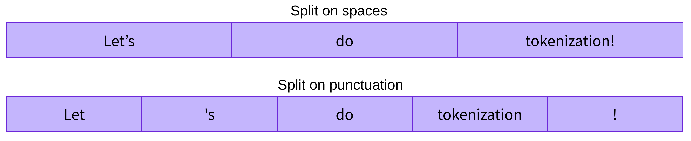

# Huggingface 🤗

- **Instructors**: Matthew Carrigan, Lysandre Debut, Sylvain Gugger
- **URL**: https://huggingface.co/course/chapter1


# Chapter 1: Transformer models

## Overview 


## Transformers, what can they do?
- The Hugging Face Hub is not limited to Transformer models.

### `pipeline` 
- End to end obj that performs an NLP task on one or several texts

```py
from transformers import pipeline

classifier = pipeline("sentiment-analysis")
classifier("I've been waiting for a HuggingFace course my whole life.")

# Output
[{'label': 'POSITIVE', 'score': 0.9598047137260437}]
```

- Currently supported pipelines
  - `feature-extraction ` (get the vector representation of a text)
  - `fill-mask`
  - `ner` (named entity recognition)
  - `question-answering`
  - `sentiment-analysis`
  - `summarization`
  - `text-generation`
  - `translation`
  - `zero-shot-classification`


### Zero shot classification
- allows you to specify which labels to use for the classification, so you don’t have to rely on the labels of the pretrained model. 

```py
from transformers import pipeline

classifier = pipeline("zero-shot-classification")
classifier(
    "This is a course about the Transformers library",
    candidate_labels=["education", "politics", "business"],
)

# Output
{'sequence': 'This is a course about the Transformers library',
 'labels': ['education', 'business', 'politics'],
 'scores': [0.8445963859558105, 0.111976258456707, 0.043427448719739914]}
 ```


### Text generation
- you can specify a `max_length` or a `min_length` for the result.

```py
generator = pipeline("text-generation")
generator("In this course, we will teach you how to")

[{'generated_text': 'In this course, we will teach you how to understand and use '
                    'data flow and data interchange when handling user data. We '
                    'will be working with one or more of the most commonly used '
                    'data flows — data flows of various types, as seen by the '
                    'HTTP'}]
```

### Mask filling
-  fill in the blanks in a given text
- Set the `top_k` parameter
- Ensure you're using the right `<mask>` token

```py
unmasker = pipeline("fill-mask")
unmasker("This course will teach you all about <mask> models.", top_k=2)

[{'sequence': 'This course will teach you all about mathematical models.',
  'score': 0.19619831442832947,
  'token': 30412,
  'token_str': ' mathematical'},
 {'sequence': 'This course will teach you all about computational models.',
  'score': 0.04052725434303284,
  'token': 38163,
  'token_str': ' computational'}]
```

### Named entity recognition

```py
ner = pipeline("ner", grouped_entities=True)
ner("My name is Sylvain and I work at Hugging Face in Brooklyn.")

#Output
[{'entity_group': 'PER', 'score': 0.99816, 'word': 'Sylvain', 'start': 11, 'end': 18}, 
 {'entity_group': 'ORG', 'score': 0.97960, 'word': 'Hugging Face', 'start': 33, 'end': 45}, 
 {'entity_group': 'LOC', 'score': 0.99321, 'word': 'Brooklyn', 'start': 49, 'end': 57}
]
```

### Question answering
- this pipeline works by extracting information from the provided context; **it does not generate the answer**.


```py
question_answerer = pipeline("question-answering")
question_answerer(
    question="Where do I work?",
    context="My name is Sylvain and I work at Hugging Face in Brooklyn"
)

# Output
{'score': 0.6385916471481323, 'start': 33, 'end': 45, 'answer': 'Hugging Face'}
```

### Summarization
- you can specify a `max_length` or a `min_length` for the result.

```py
from transformers import pipeline

summarizer = pipeline("summarization")
summarizer("""
    America has changed dramatically during recent years. Not only has the number of 
    graduates in traditional engineering disciplines such as mechanical, civil, 
    electrical, chemical, and aeronautical engineering declined, but in most of 
    the premier American universities engineering curricula now concentrate on 
    and encourage largely the study of engineering science. As a result, there 
    are declining offerings in engineering subjects dealing with infrastructure, 
    the environment, and related issues, and greater concentration on high 
    technology subjects, largely supporting increasingly complex scientific 
    developments. While the latter is important, it should not be at the expense 
    of more traditional engineering.

    Rapidly developing economies such as China and India, as well as other 
    industrial countries in Europe and Asia, continue to encourage and advance 
    the teaching of engineering. Both China and India, respectively, graduate 
    six and eight times as many traditional engineers as does the United States. 
    Other industrial countries at minimum maintain their output, while America 
    suffers an increasingly serious decline in the number of engineering graduates 
    and a lack of well-educated engineers.
""")

# Output
[{'summary_text': ' America has changed dramatically during recent years . The '
                  'number of engineering graduates in the U.S. has declined in '
                  'traditional engineering disciplines such as mechanical, civil '
                  ', electrical, chemical, and aeronautical engineering . Rapidly '
                  'developing economies such as China and India, as well as other '
                  'industrial countries in Europe and Asia, continue to encourage '
                  'and advance engineering .'}]
```

### Translation
- you can specify a `max_length` or a `min_length` for the result.

```py
translator = pipeline("translation", model="Helsinki-NLP/opus-mt-fr-en")
translator("Ce cours est produit par Hugging Face.")

[{'translation_text': 'This course is produced by Hugging Face.'}]
```


### Using any model from the Hub in a pipeline
- Browse the Model Hub: https://huggingface.co/models
- Load it in: `generator = pipeline("text-generation", model="distilgpt2")`


## How do Transformers work?
Broadly, they can be grouped into three categories:
- **GPT-like **("auto-regressive" T models)
- **BERT-like **("auto-encoding" T models)
- **BART/T5-like **("sequence to sequence" T models)

### Transformers are language models
-  trained on large amounts of raw text in a self-supervised fashion
-  self-supervised learning is a type of training in which the objective is automatically computed from the inputs of the model
- the general pretrained model then goes through a process called transfer learning. 
- An example of a task is predicting the next word in a sentence having read the n previous words. This is called **causal language modeling** because the output depends on the past and present inputs, but not the future ones.
- Another example is masked language modeling, in which the model predicts a masked word in the sentence

### Transformers are big models

- training large models requires a large amount of data
- costly in terms of time, compute, carbon footprint\


-The pretrained model was already trained on a dataset that has some similarities with the fine-tuning dataset. The fine-tuning process is thus able to take advantage of knowledge acquired by the initial model during pretraining 

- For best performance, pretrained models should be as similar to the fine-tuned one as possible. Eg. If classifying German sentences, it's better to use a German pretrained model

### General Architecture


- Encoder and Decoder can be used together or individually

-**Encoder**
  - The encoder receives an input and builds a representation of it (its features). This means that the model is optimized to acquire understanding from the input.
- Components
  - Bi-directional ("auto-encoding")
  - Self Attention

- **Decoder**
- The decoder uses the encoder’s representation (features) along with other inputs to generate a target sequence. This means that the model is optimized for generating outputs.
- Can also accept text inputs
- Components
  - Uni-directional
  - Auto-regressive
  - Masked self attention + Cross attention

- **Encoder-Decoder**
  - Called a "sequence to sequence" transformer

- Attention: a word by itself has a meaning, but that meaning is deeply affected by the context, which can be any other word (or words) before or after the word being studied.

### Applications
- **Encoder-only models**: Good for tasks that require understanding of the input, such as sentence classification and named entity recognition.
- **Decoder-only models**: Good for generative tasks such as text generation.
- **Encoder-decoder models**: Good for generative tasks that require an input, such as translation or summarization.


### The orginal architecture
- Attention is all you need - Originally for translation
- During training
  - Encoder receives input in one language
  - Decoder receives the same sentence in target language
  - Encoder can pay attention to all inputs
  - Decoder works sequentially - can only pay attention to parts of the input it has already translated  
  - For example, when we have predicted the first three words of the translated target, we give them to the decoder which then uses all the inputs of the encoder to try to predict the fourth word.
  - To speed things up, decoder is sent the whole target, but not allowed to use the future words
  - The attention mask can also be used in the encoder/decoder to prevent the model from paying attention to some special words (eg. for batching)


### Architecture, checkpoints

- **Architecture**: skeleton of the model — the definition of each layer and each operation that happens within the model. (eg. BERT)
- **Checkpoints**: weights that will be loaded in a given architecture. (eg. `bert-base-cased`)
- **Model**: umbrella term that isn’t as precise as “architecture” or “checkpoint”: it can mean both. This course will specify architecture or checkpoint when it matters to reduce ambiguity.

## Encoder models


- Outputs exactly one feature vector per token
- Dimension of vectors is defined by arch (bert base = 768)
- Value of each word is contextual (affected by other words in the sequence) because of self attention
- When to use it
  - Bi-directional applications: context from left and right
  - Good at extracting meaningful information
  - NLU
- Examples
  - BERT, RoBERTa, ALBERT, DistilBERT
- Applications
  - Masked Language Modelling
    - My [mask] is Niyas Mohammed
    - Requires semantic as well as syntactic understanding
  - Seq classification
  - Extractive Question answering
  - Word classification
  - Sentiment analysis
    - Relationship between words

## Decoder models
- Outputs numerical representaiton from an initial sequence (one per token)
- Words can only see words on their left side ("Masked self attention")
- When to use it
  - Uni directional: LTR or RTL
  - Great at generating sequences
  - NLG
- Examples
  - GPT-2, GPT Neo, Transformer XL, CTRL
- Applications
  - Causal language modelling (differnt from Masked Lang Modelling)
    - Uni directional
    - Good at generating words given a context

## Sequence to Sequence models

- Encoder and decoder often do not share weights
- Ouput length is independent of input length
  - Eg. Translation, Summarizations
- Pretraining is usually more complex than MLM: 
  - For instance, T5 is pretrained by replacing **random spans of text (that can contain several words)** with a **single mask special word**, and the objective is then to predict the text that this mask word replaces.
- Examples
  - BART, T5, Pegasus
  - Can also be built from two diff archs: BERT + GPT-2

## Bias and limitations

```py
from transformers import pipeline

unmasker = pipeline("fill-mask", model="bert-base-uncased")
result = unmasker("This man works as a [MASK].")
print([r["token_str"] for r in result])

result = unmasker("This woman works as a [MASK].")
print([r["token_str"] for r in result])

['lawyer', 'carpenter', 'doctor', 'waiter', 'mechanic']
['nurse', 'waitress', 'teacher', 'maid', 'prostitute']
```

- This happens even though BERT is one of the rare Transformer models **not built by scraping data from all over the internet**, but rather using apparently neutral data (it’s trained on the English Wikipedia and BookCorpus datasets). 
- When you use these tools, you therefore need to keep in the back of your mind that the original model you are using could very easily generate sexist, racist, or homophobic content. 
- **Fine-tuning the model on your data won’t make this intrinsic bias disappear.**

- Possible sources of bias
  - The model is a fine-tuned version of a pretrained model and it picked up its bias from it.
  - The data the model was trained on is biased.
  - The metric the model was optimizing for is biased.

# Chapter 2: Using Transformers
## Introduction
- In this chapter, you will learn:
  - How to use tokenizers and models to replicate the pipeline API’s behavior
  - How to load and save models and tokenizers
  - Different tokenization approaches, such as word-based, character-based, and subword-based
  - How to handle multiple sentences of varying lengths

- 🤗 Transformers goal is to provide a single API through which any Transformer model can be loaded, trained, and saved
  - Ease of use: download in 2 lines of code
  - Flexibility: Plain `nn.Module` or `tf.keras.Model` classes
  - Simplicity: All in one file. Hardly any abstractions.

- Tokenizers take care of the **first and last processing steps**, handling the conversion from text to numerical inputs for the neural network, and the conversion back to text when it is needed.

## Behind the Pipeline


### 1. Preprocessing with the tokenizer
- Tokenizer
  - Splitting the input into words, subwords, or symbols (like punctuation) that are called tokens
  - Mapping each token to an integer
  - Adding additional inputs that may be useful to the model

- All this preprocessing needs to be done in **exactly the same way as when the model was pretrained**
- Use `AutoTokenizer.from_pretrained` 

```py
from transformers import AutoTokenizer

checkpoint = "distilbert-base-uncased-finetuned-sst-2-english"
tokenizer = AutoTokenizer.from_pretrained(checkpoint)
```

Once we have the tokenizer, we can directly pass our sentences to it and we’ll get back a dictionary that’s ready to feed to our model! The only thing left to do is to convert the list of input IDs to tensors.

To specify the type of tensors we want to get back (PyTorch, TensorFlow, or plain NumPy), we use the return_tensors argument:

```py
raw_inputs = [
    "I've been waiting for a HuggingFace course my whole life.", 
    "I hate this so much!",
]
inputs = tokenizer(raw_inputs, padding=True, truncation=True, return_tensors="pt")
print(inputs)


{
    'input_ids': tensor([
        [  101,  1045,  1005,  2310,  2042,  3403,  2005,  1037, 17662, 12172, 2607,  2026,  2878,  2166,  1012,   102],
        [  101,  1045,  5223,  2023,  2061,  2172,   999,   102,     0,     0,     0,     0,     0,     0,     0,     0]
    ]), 
    'attention_mask': tensor([
        [1, 1, 1, 1, 1, 1, 1, 1, 1, 1, 1, 1, 1, 1, 1, 1],
        [1, 1, 1, 1, 1, 1, 1, 0, 0, 0, 0, 0, 0, 0, 0, 0]
    ])
}
```

### Going through the model
- `AutoModel.from_pretrained`

```py
from transformers import AutoModel

checkpoint = "distilbert-base-uncased-finetuned-sst-2-english"
model = AutoModel.from_pretrained(checkpoint)
```

- For each model input, we’ll retrieve a high-dimensional vector representing the **contextual understanding of that input** by the Transformer model.

- **They’re usually inputs to** another part of the model, known as the **head**.

- Vector shape
  - Batch size
  - Sequence length
  - Hidden size

```py
outputs = model(**inputs)
# @niazagnels: I could not get `.last_hidden_state`- there seemed to be no such method
# Nor is it in the associated colab notebook

# 1 hour later

# @niazagnels: It seems `.last_hidden_state`  is available only for pretrained models (BertModel).
# BertModelForSequenceClassification has `.logits` (which isnt there in BertModel) but not `.last_hidden_state`
print(outputs.last_hidden_state.shape)

torch.Size([2, 16, 768])
```

- outputs of 🤗 Transformers models behave like `namedtuples`. Access the elements by attributes, keys or indices.

### Model heads


- Heads are usually a few linear layers

- `AutoModel` (base - retrieve hidden states)
  - *ForCausalLM
  - *ForMaskedLM
  - *ForMultipleChoice
  - *ForQuestionAnswering
  - *ForSequenceClassification
  - *ForTokenClassification

- Dimensionality will be much lower for specific tasks: the model head takes as input the high-dimensional vectors and outputs vectors containing two values (one per label):

```py
from transformers import AutoModelForSequenceClassification

checkpoint = "distilbert-base-uncased-finetuned-sst-2-english"
model = AutoModelForSequenceClassification.from_pretrained(checkpoint)
outputs = model(**inputs)

print(outputs.logits.shape)

torch.Size([2, 2])
```

- The outputs of these models are **logits**,  the raw, unnormalized scores outputted by the last layer of the model. 

```py
print(outputs.logits)

tensor([[-1.5607,  1.6123],
        [ 4.1692, -3.3464]], grad_fn=<AddmmBackward>)
```

- To be converted to probabilities, they need to go through a `SoftMax` layer

```py
predictions = torch.nn.functional.softmax(outputs.logits, dim=-1)
print(predictions)

tensor([[4.0195e-02, 9.5980e-01],
        [9.9946e-01, 5.4418e-04]], grad_fn=<SoftmaxBackward>)
```
- To get the labels corresponding to each position, we can inspect the `id2label` attribute of the model config 

```py
model.config.id2label

{0: 'NEGATIVE', 1: 'POSITIVE'}
```

- So now we conclude that 
    - First sentence: NEGATIVE: 0.0402, POSITIVE: 0.9598
    - Second sentence: NEGATIVE: 0.9995, POSITIVE: 0.0005


## Models




- **IMPORTANT:** Creating a model from the default configuration initializes it with random values:
- Cache is at `~/.cache/huggingface/transformers`


- Saving models
```py
model.save_pretrained("directory_on_my_computer")

# This saves two files to your disk:
```
```bash
! ls directory_on_my_computer

config.json pytorch_model.bin
```
### Using a Transformer model for inference
- Transformer models can only process numbers — numbers that the tokenizer generates.
- Tokenizers can take care of casting the inputs to the appropriate framework’s tensors
- The tokenizer converts these to vocabulary indices which are typically called `input IDs`. Each sequence is converted to a list of numbers.
```py
sequences = [
  "Hello!",
  "Cool.",
  "Nice!"
]

encoded_sequences = [
  [ 101, 7592,  999,  102],
  [ 101, 4658, 1012,  102],
  [ 101, 3835,  999,  102]
]
```

- This is a list of encoded sequences: a list of lists. Tensors only accept rectangular shapes (think matrices). This “array” is already of rectangular shape, so converting it to a tensor is easy:
```py
model_inputs = torch.tensor(encoded_sequences)
```
Now we can feed it into the model

```py
output = model(model_inputs)
```

- While the model accepts a lot of different arguments, **only the input IDs are necessary**.

## Tokenizers

### Word based  Tokenizers

- Information help per word is high: contains textual and semantic representation
- Cons:
  - 'dog' and 'dogs' are very similar, but will have different represetnations
  - vocab can end up very large
  - large vocabs result in heavy models
  - we could limit the vocab, but we will have a lot of unknowns
  - Out of Vocabulary will result in loss of information
  - All OOV terms will have same representation

### Character based Tokenizers
- Pros:
  - Samller vocab
  - Fewer OOV
- Cons:
  - concerns regarding spaces and punctuation
  - each character does not mean a lot
  - we will end with a large amount of tokens to be processed
- While it has its issues, it has yielded some very good results in the past and should be considered for new projects

### Subword based Tokenizers

- Principles
  - Frequently used words should not be split into smaller subwords
  - Rare words should be decomposed to meaningful subwords
  


- Different algorithms
  - WordPiece
    - BERT
    - DistilBERT
  - Unigram
    - XLNet
    - AlBERT
  - Byte-Pair Encoding
    - GPT-2
    - RoBERTa


### Loading and Saving Tokenizers
- `from_pretrained` and `save_pretrained`

```py
from transformers import BertTokenizer

tokenizer = BertTokenizer.from_pretrained("bert-base-cased")
```

```py
from transformers import AutoTokenizer

tokenizer = AutoTokenizer.from_pretrained("bert-base-cased")
tokenizer.save_pretrained("directory_on_my_computer")
```

Now we can tokenize the sentece

```py
tokenizer("Using a Transformer network is simple")

{'input_ids': [101, 7993, 170, 11303, 1200, 2443, 1110, 3014, 102],
 'token_type_ids': [0, 0, 0, 0, 0, 0, 0, 0, 0],
 'attention_mask': [1, 1, 1, 1, 1, 1, 1, 1, 1]}
```

### Encoding


- Doesn't quite happen in this order. This is for brevity.
- Different tokenizers use different conventions
  
```py
tokenizer = AutoTokenizer.from_pretrained("bert-base-uncased")
tokenizer.tokenize("Let's try to tokenize!")

['let', "'", 's', 'try', 'to', 'token', '##ize', '!']
```

```py
# All Sentencepiece tokenizers
tokenizer = AutoTokenizer.from_pretrained("albert-base-v1")
tokenizer.tokenize("Let's try to tokenize!")

['▁let', "'", 's', '▁try', '▁to', '▁to', 'ken', 'ize', '!']
```

- To convert tokens to ids, use `Tokenizer.convert_tokens_to_ids`

```py
ids = tokenizer.convert_tokens_to_ids(tokens)
print(ids)

[7993, 170, 11303, 1200, 2443, 1110, 3014]
```

### Decoding
- `Tokenizer.decode` allows us to see the final representation of the tokenizer translates back to text

```py
decoded_string = tokenizer.decode([7993, 170, 11303, 1200, 2443, 1110, 3014])
print(decoded_string)

'Using a Transformer network is simple'
```

## Handling multiple sequences

### Model expects multiple sentences by default
```py
t = AutoTokenizer(...)
input_ids = torch.tensor(t.convert_to_ids(t.tokenize(sentence:str)))

# The following line will fail
model(input_ids)
```
- `return_tensors` will not only convert to tensor, but also add another dim

```py
tokenized_inputs = tokenizer(sequence, return_tensors="pt")
print(tokenized_inputs["input_ids"])

tensor([[  101,  1045,  1005,  2310,  2042,  3403,  2005,  1037, 17662, 12172,
          2607,  2026,  2878,  2166,  1012,   102]])
```

### Padding the inputs
- When you’re trying to batch together two (or more) sentences, they might be of different lengths.
- This breaks the rectangular nature and we can't convert the batch to tensors anymore.
- This is why we need padding

```py
padding_id = 100

batched_ids = [
  [200, 200, 200],
  [200, 200, padding_id]
]
```
- You can user `Tokenizer.pad_token_id` to find the padding token id

- However, padding token will be treated as an input to the model and will change the output of the model
```py
ids = [
       [101, 200, 102],
       [101, 200, 102, tokenizer.pad_token_id] 
      ]

for seq in ids:
    inputs = torch.tensor([seq])
    print(model(inputs).logits)


tensor([[-1.3966,  1.4732]], grad_fn=<AddmmBackward>)
tensor([[-1.0877,  1.1873]], grad_fn=<AddmmBackward>)
```

- This is because attention layers contextualize each token. These will take into account the padding tokens since they attend to all of the tokens of a sequence.
- To prevent this, we need attention mask

### Attention mask
- Attention masks are tensors with the exact same shape as the input IDs tensor, filled with 0s and 1s
- 1s indicate the corresponding tokens should be attended to, and 0s indicate the corresponding tokens should not be attended to 

```py
ids = [
       [101, 200, 102],
       [101, 200, 102, tokenizer.pad_token_id] 
      ]

attn_mask = [
             [1, 1, 1],
             [1, 1, 1, 0],
]
for seq, att in zip(ids, attn_mask):
    seq, att = torch.tensor([seq]), torch.tensor([att]), 
    print(model(seq, attention_mask=att).logits)


tensor([[-1.3966,  1.4732]], grad_fn=<AddmmBackward>)
tensor([[-1.3966,  1.4732]], grad_fn=<AddmmBackward>)
```

### Longer sequences
- Most models handle sequences of up to 512 or 1024 tokens, and will crash when asked to process longer sequences. 
- There are two solutions to this problem:
  - Use a model with a longer supported sequence length. (Longformer, LED)
  - Truncate your sequences.

## Putting it all together

- When you call your tokenizer directly on the sentence, you get back inputs that are ready to pass through your model:

```py
# Will pad the sequences up to the maximum sequence length
model_inputs = tokenizer(sequences, padding="longest")

# Will pad the sequences up to the model max length
# (512 for BERT or DistilBERT)
model_inputs = tokenizer(sequences, padding="max_length")

# Will pad the sequences up to the specified max length
model_inputs = tokenizer(sequences, padding="max_length", max_length=8)
```

```py
sequences = [
  "I've been waiting for a HuggingFace course my whole life.",
  "So have I!"
]

# Will truncate the sequences that are longer than the model max length
# (512 for BERT or DistilBERT)
model_inputs = tokenizer(sequences, truncation=True)

# Will truncate the sequences that are longer than the specified max length
model_inputs = tokenizer(sequences, max_length=8, truncation=True)
```

```py
# Returns PyTorch tensors
model_inputs = tokenizer(sequences, padding=True, return_tensors="pt")

# Returns TensorFlow tensors
model_inputs = tokenizer(sequences, padding=True, return_tensors="tf")

# Returns NumPy arrays
model_inputs = tokenizer(sequences, padding=True, return_tensors="np")
```

### Special tokens
- Tokenizer also add special tokens such as [CLS] at the beginning and [SEP] at the end