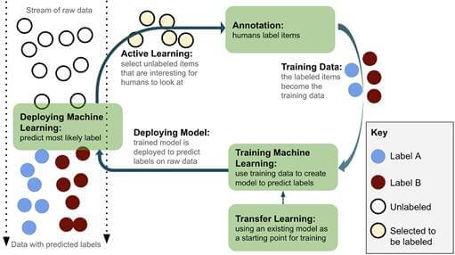
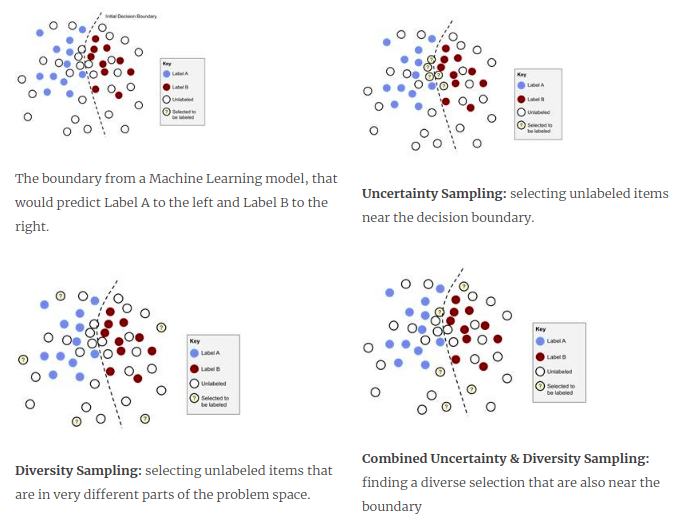
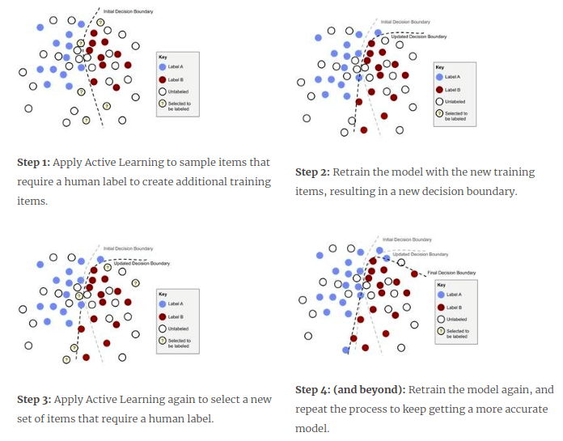

# 1 Introduction to Human-in-the-Loop Machine Learning
- what are the right ways for humans and machine learning algorithms to interact to solve problems?
- Annotation and Active Learning are the cornerstones of Human-in-the-Loop Machine Learning. 
- They determine how you get training data from people, and what is the right data to put in front of people when you don’t have the budget or time for human feedback on all of your data. 
- Transfer Learning allows us avoid a cold-start, adapting existing Machine Learning models to our new task, rather than starting at square one.
- Human-in-the-Loop Machine Learning is when humans and Machine Learning processes interact to solve one or more of the following:
  - Making Machine Learning more accurate
  - Getting Machine Learning to the desired accuracy faster
  - Making humans more accurate
  - Making humans more efficient (at labelling - eg. predictive text suggestions)

- Much more time is spent curating and annotating data sets than actually building the Machine Learning models.
- Algorithms and annotation are equally important and intertwined components of good Machine Learning.

- Machine Learning researchers have tended to keep the datasets constant, and evaluated their Machine Learning in terms of different algorithms.
- In contrast, it is more common in industry to improve model performance by annotating more training data. Especially when the nature of the data is changing over time, then just a handful of new annotations can be very effective.
  
- Humans providing the labels can make errors, and overcoming these errors requires surprisingly sophisticated statistics.
- If a Machine Learning algorithm powering an autonomous vehicle doesn’t see 1% of pedestrians due to errors propagated from bad training data, it would be disastrous. 
- Some algorithms can handle a little noise in the training data, and random noise will even help some algorithms become more accurate by avoiding overfitting. 
- But **human errors tend not to be random noise** and therefore tend to **introduce irrecoverable bias** into training data. **No algorithm can survive truly bad training data**.

- For simple tasks, like binary labels on objective tasks, the statistics are fairly straightforward to decide which is the ‘correct’ label when different annotators disagree.
- But for subjective tasks, or *even objective tasks with continuous data* (???) there are no simple heuristics for deciding what the correct label should be.
- What if two annotators draw slightly different bounding boxes for an object detection task? Which is the correct one? It’s not necessarily either individual box or the average of the two boxes. In fact, **the best way to resolve this problem is with Machine Learning itself**.

- **Active Learning is the process of selecting which data needs to get a human label**
- Historically concerned with number of training items.
- Any delay in disaster response is potentially critical, so getting a usable model out quickly is more important than the number of labels that need to go into that model.
- There is no one strategy for Active Learning that will be optimal across all use cases and data sets, but there are some approaches you should try first

- Active Learning sampling strategies: 
  - Random sampling
    - it can actually be the trickiest
    - what is random if your data is 
      - pre-filtered
      - changing over time, 
      - if you know your sample will not be representative of the problem you are addressing
      - Regardless of the strategy, some amount of random data should always be annotated as a control group for comparing your Active Learning.

  - Uncertainty sampling
    - aka "Exploitation"
    - identifying unlabeled items that are near a decision boundary of your model
    - These items are most likely to be wrongly classified
    - They are the most likely to result in a label that is different from the predicted label, moving the decision boundary once they have been added to the training data and the model has been retrained.

  - Diversity sampling 
    - aka "Exploration", "Outlier Detection" and "Anomaly Detection"
    - Strategy for identifying unlabeled items that are unknown to the Machine Learning model in its current state.
    - Will likely contain combinations of feature values that are rare or unseen in the training data
    - Can also be used as a standalone solution for tasks like identifying new phenomena in astronomical databases or detecting strange network activity for security
    - **Representative Sampling** explicitly trying to find the unlabeled items that most look like the unlabeled data, compared to the training data. It is a good method to implement when you know that the data is changing over time.
    - Diversity Sampling can mean using intrinsic properties of the dataset, like the distribution of labels- you might want to deliberately try to get an **equal number of human annotations for each label**, even though some labels are much rarer than others, ensuring that the data is representative of important external properties of the data, or ensuring that **data comes from a wide variety of demographics** of the people represented in the data, in order to overcome real-world bias in the data. 

- Uncertainty Sampling might just focus on one part of the decision boundary, and Diversity Sampling might just focus on outliers that are a long distance from the boundary. 
- So the strategies are often used together to find a selection of unlabeled items that will maximize both Uncertainty and Diversity.

- Active Learning process is iterative. In each iteration of Active Learning, a selection of items are identified and receive a new human-generated label. The model is then re-trained with the new items and the process is repeated.

- Ideally, our Active Learning strategy means that we have requested human labels for the minimum number of items. This speeds up the time to get to an accurate model, and reduces the cost of human labeling.

- Imagine that you only used Uncertainty Sampling, and you only sampled from one part of the problem space in an iteration. It may be the case that you solve all uncertainty in that part of the problem space, and therefore the next iteration will concentrate somewhere else. 
- With enough such iterations, you might not need Diversity Sampling at all: the data collected over the iterations together are enough to get a diverse sample of items for training.
- However, if you have some part of your data space that is inherently ambiguous, then each iteration could keep bringing you back to the same part of the problem space with those ambiguous items. So, it is generally wise to consider both Uncertainty and Diversity sampling strategies.

### Adaptive active learning
- In adaptive Machine+Human Translation, a single keystroke from a human translator was enough to guide the Machine Learning model to a different prediction, and a single translated sentence was enough training data to require the model to update, ideally within a few seconds at most. 
- It is easy to see why from a User Experience perspective: if a human translator corrects the machine prediction for some word, but the machine doesn’t adapt quickly, then the human might need to (re)correct that machine output 100s of times.
- It will be a bad experience if the software keeps making the same mistake so soon after a human has corrected it, because we expect recency to help with adaptation.

### What is a random selection of evaluation data?
- If you have pre-filtered the data that you are working with by keyword, time,etc., then you already have a non-representative sample. The accuracy on that sample is not necessarily indicative of the accuracy on a broader selection of data.
- If you take those a trained ImageNet model and apply them to a random selection of images posted on a social media platform, the accuracy immediately drops to something like 10%.
- The data will change over time, too- the topics that people talk about will change over time and the languages themselves will innovate and evolve in reasonably small time frames, the images themselves will change based on advances and changes in camera technology.
- If you can't define a meaningful random set of evaluation data, then you should try to define a representative evaluation data set- admitting that a truly random sample isn't possible or isn't meaningful for your data set.
- You might want to select a number of data points for every label that you care about, a certain number from every time period, or a certain number from the output of a clustering algorithm to ensure diversity (more about this in a later chapter) in your "representative" dataset
- You might also want to have multiple evaluation data sets that are compiled through different criteria. One common strategy is to have one data set drawn from the same data as the training data, and having one or more out of domain evaluation data sets drawn from different data sets. The out of domain data sets are often drawn from **different types of media** or from **different time periods**.
- For most real-world applications, having an out-of-domain evaluation data set is recommended.
- This can be tricky with Active Learning, because as soon as you start labelling that data, it is no longer out of domain. If practical, it is recommended that you keep an out-of-domain data set for which you don't apply Active Learning.

### When to use active learning
- You should use Active Learning when you can only annotate a very small fraction of your data and when random sampling will not cover the diversity of data
- If you want to put a bounding box around every object in every frame of a video, this would be very time consuming.
-  Decisions about the annotation process: is every Nth frame in a video ok? Can we sample the videos so we don’t have to annotate them all? Are there ways that we can design interface for annotation to speed up the process?
- If your baseline model is already accurate enough for your business use case, or the cost to benefit of more training data is not viable, stop active learning

### Machine Learning and Human-Computer Interaction
- As soon as a human translator needs to correct 1 or 2 errors in a sentence from Machine Translation output, it would have been quicker from the translator to type out the whole sentence
- Predict then correct did not improve speed. Unless the human translator took extra care they would end up perpetuating errors in the Machine Translation, making their translation less accurate.
- The eventual solution to this problem was in the user interface. Modern translation systems now let human translators use the same kind of predictive text that has become common in phones (tab to accept the next word in the predicted translation)
- If you can simplify or break up your annotation project into binary tasks, then it is a lot easier to design an intuitive interface
- For anyone who is undertaking repetitive tasks like creating training data, moving a mouse is inefficient and should be avoided if possible.
- If you have to include a mouse, you should be getting rich annotations to make up for the slower inputs.
- People who transcribe speech to text often use foot-pedals to navigate back and forward in time in the audio recording 😮, allowing their hands to remain on the keyboard to type the transcription.

- When the context or sequence of events can influence human perception, it is known as priming. In a study, it was enough to make people interpret an accent as sounding more New Zealand-like when a Kiwi was present, and more Australian-like when a Kangaroo was present
- Repetition priming- 99 negative sentiment posts in a row, then they are more likely to make an error by labeling the 100th post as negative, when it is actually positive

- **Predict then correct: ** Binary input form to have people evaluate a Machine Learning prediction and confirm/reject that prediction.  you run the risk of focusing on localized model uncertainty and missing important parts of the problem space- you will still need a diversity strategy for sampling.

- There is a common misconception that search engines are trained only on the feedback from end users. In fact, all the major search engines also employ thousands annotators to evaluate and tune their search engines.
- Historically, Transfer Learning meant feeding the outputs of one process into another. An example in NLP might be:`General Part-of-Speech Tagger -> Syntactic Parser -> Sentiment Analysis Tagger`
- Transfer learning in NLP: The English phrase “my monkey is cute” is very rare online.monkey” context is unlikely to occur in large volumes in any language. So, we need to be aware that pre-trained systems will tend to **amplify cultural biases.**
- **Known Knowns**: what your Machine Learning model can confidently and accurately do today. This is your model in its current state.
- **Known Unknowns**: what your Machine Learning model cannot confidently do today. You can apply Uncertainty Sampling to these items.
- **Unknown Knowns**: knowledge within pre-trained models that can be adapted to your task. Transfer learning allows you to use this knowledge.
- **Unknown Unknowns**: gaps in your Machine Learning model where it is blind today. You can apply Diversity Sampling to these items.
  
- The top row captures your model’s knowledge.
- The bottom row captures knowledge outside of your model.
- The left column can be addressed by the right algorithms.
- The right column can be addressed by human interaction.This text covers a wide range of technologies, so it might help to keep this handy to know where everything fits in.
  