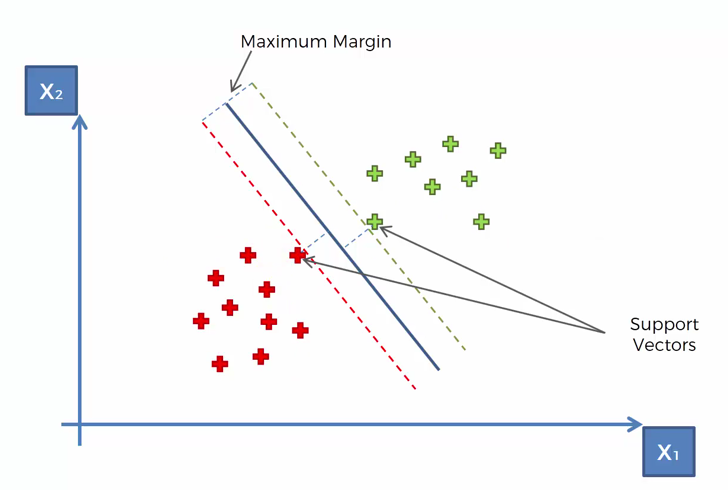
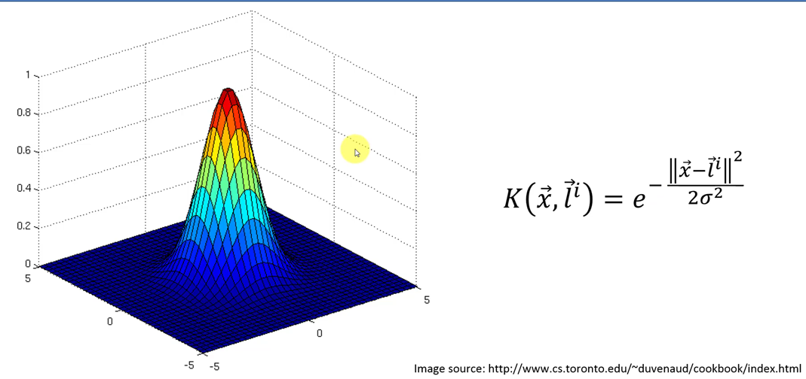
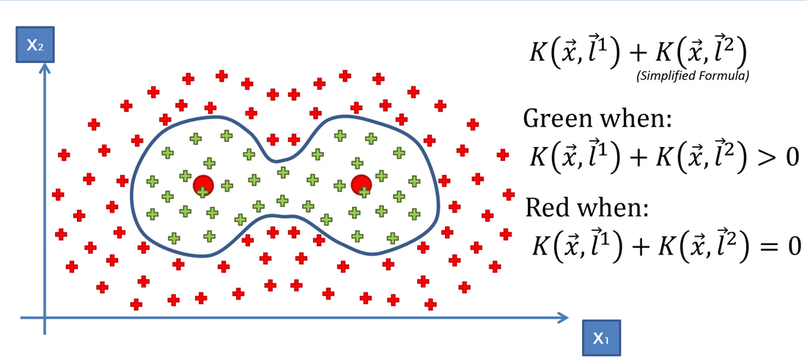

# Support Vector Machines

## Resources
- http://www.chioka.in/explain-to-me-what-is-the-kernel-trick/
- https://towardsdatascience.com/understanding-support-vector-machine-part-2-kernel-trick-mercers-theorem-e1e6848c6c4d
- https://medium.com/@zxr.nju/what-is-the-kernel-trick-why-is-it-important-98a98db0961d

## Notes

- Only dependent on two points here.
- Could remove all other points and still have the same effect
- These two points are called the supports
- Maximum margin hyperplane separates the two regions (positive and negative)
- It doesnt matter which one is positive or negative as long as you indicate which one you use for a given class
- Most ML models would try to learn what a typical example of each class would look like (eg. k-means) 
- SVM on the other hand, looks at the examples of a class which is extremely similar to that of the other class. These are the support vectors
- This is why at times, they work much better than other ML algorithms

###  How can we separate non linearly separable datasets?
- Increase dimensionality and make sure the points are linearly separable given the new dimension
- This includes taking a one dimensional number line, shifting the origin (eg. x-5) and maybe squaring the result to obtain a new co-ordinate (so now y = (x - 5) ^ 2)
- **Mapping to a higher dimensional space can be computationally expensive**
- This can be avoided with the _Kernel trick_

## Kernel Trick
- Below is the Gaussian RBF
- _l_ indicates landmarks. Here the landmark is set to the origin 

- Range of y axis is [0,1)
- There's a way to find the optimal landmark for a given kernel and dataset

 > 0)")
- Increasing sigma increases radius (where f(x) > 0)

- You can even combine two or more SVMs