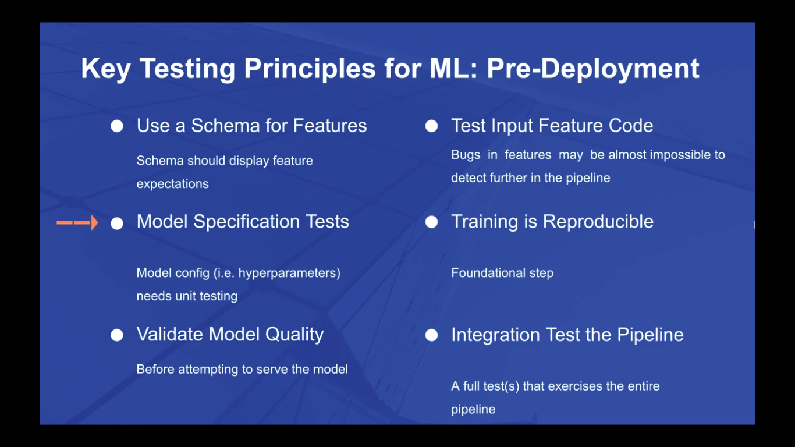
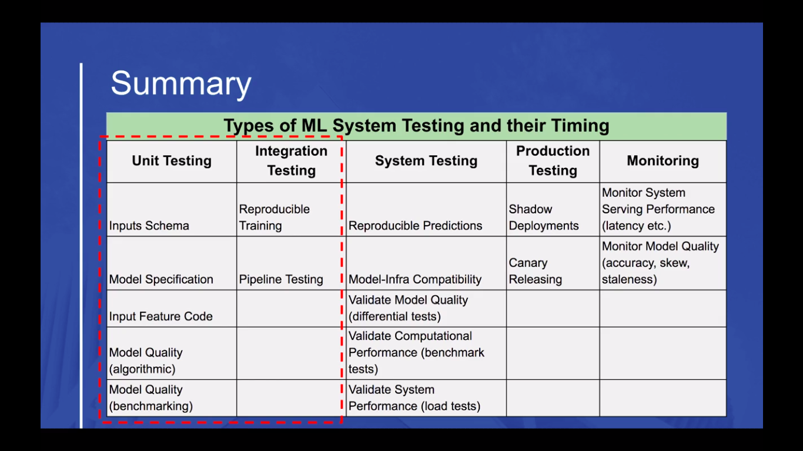

# Testing & Monitoring Machine Learning Model Deployments

# Feedback
  - I learnt a ton of new stuff!
  - http://dsacademy.io/ gives 404. However, https://www.dsacademy.io/ works. Is this intentional?
  - 0202_DeployingModelProduction.mp4 8:22 "business, *hooyaa*, and ... *See you in a week*"
  - Should there be more info provided for unit, integ, system tests? - https://www.dsacademy.io/courses/testing-monitoring-machine-learning-model-deployments/189992-testing-concepts/565147-testing-concepts-testing-theory-mp4
  - All reading resources are great! I have to go thouroughly over all of them again. Pretty sure there is a lot more in the lecture notes, but currently the notes are missing for a lot of videos.
    - Add rules of machine learning?
    - Mention Facets in input data validation? https://pair-code.github.io/facets/
  - An inconsistancy I noticed is Soledad and Chris seems to be installing things on Windows machine, but are developing with Mac? 
    - [Git repo and data](https://www.dsacademy.io/courses/testing-monitoring-machine-learning-model-deployments/192047-course-scenario-model-lifecycle/569026-0203_gitrepoanddata-mp4)
    - [Python installation](https://www.dsacademy.io/courses/testing-monitoring-machine-learning-model-deployments/189992-testing-concepts/560440-python-installation-mp4)
    - [Installing Jupyter](https://www.dsacademy.io/courses/testing-monitoring-machine-learning-model-deployments/189992-testing-concepts/560507-install-jupyter-mp4) 
    - [Pytest Intro Lecture](https://www.dsacademy.io/courses/testing-monitoring-machine-learning-model-deployments/185986-unit-testing-ml-systems/549335-pytest_intro_lecture-mp4)
  - Isnt' model = (data + training + algorithm) - 00:57 https://www.dsacademy.io/courses/testing-monitoring-machine-learning-model-deployments/189992-testing-concepts/565026-testing-concepts-testing-ml-systems-mp4
  - Should python installation be taught midway into the course? This is an advanced course. Or can we move this to appendix? https://www.dsacademy.io/courses/testing-monitoring-machine-learning-model-deployments/189992-testing-concepts/560440-python-installation-mp4
  - Should all installations be together? Maybe not- compare with Docker and Kubernetes course
  - Sole clones without installing git in https://www.dsacademy.io/courses/testing-monitoring-machine-learning-model-deployments/192047-course-scenario-model-lifecycle/569026-0203_gitrepoanddata-mp4
  - "Its also useful for persistance"x2 - 4:00-4:04 https://www.dsacademy.io/courses/testing-monitoring-machine-learning-model-deployments/189992-testing-concepts/562380-unit-testing-concepts-exercise-1-notebook-mp4
  - Remove this post?: https://www.indiehackers.com/post/question-about-online-course-sponsorship-d9c4de276a
  - Docker intro slide is not full screen  - https://www.dsacademy.io/courses/testing-monitoring-machine-learning-model-deployments/188115-docker-refresher/562586-containers-introduction-mp4
  - During differential testing, we're using X_test, y_test. However, isn't it a convention to use a completely different split that is never shown to the model (train/dev/test split?)
  - Running tox without `skipsdist=True` threw an error: `ERROR: No pyproject.toml or setup.py file found. The expected locations are:`. I had copied my code as from tox website which did not have this line.
  - Should `tox` be introduced *after* `pytest`? Seems more logical that way.
  - Was Model bias and fairness really covered? - 1:16 https://www.dsacademy.io/courses/testing-monitoring-machine-learning-model-deployments/185986-unit-testing-ml-systems/561515-unit-test-systems-wrap-up-mp4
  - Stephen Grider: "In the last video... / Now that we have our ...", end with "In the next video.." - makes it easy to figure out what video contains something I'm looking for. Might be possible only after you fix your video order. This is there in some of the videos- would love to see it in any more you're rerecording.
  - fast forward instead of jump cuts when installing things - https://www.dsacademy.io/courses/testing-monitoring-machine-learning-model-deployments/188115-docker-refresher/559744-docker_install_instructions_updated-mp4
  - tests in separate folders: unit, integration, system
  - integration tests were mostly system tests?
    - unit - Transform
    - integration - Pipeline
    - system - api
  - Integration benchmark quality tet was skimmed over rather quickly. An illustration would have helped make this concrete https://www.dsacademy.io/courses/testing-monitoring-machine-learning-model-deployments/188107-integration-testing-ml-systems/555526-integration-tests-benchmark-theory-mp4
  - There was a video with really jerky audio cuts
  - Could you talk more about when these tests should be updated/ changed - One place you touch upon this is here: 1:20 - https://www.dsacademy.io/courses/testing-monitoring-machine-learning-model-deployments/188716-differential-testing/558968-differential-testing-theory-mp4
  - Shadow mode theory should have come first?? (niazangels pls check)
  - In shadow mode databases, shouldn't we enter datetime ourselves when a call is made? Otherwise the models will have different timings 4:10 https://www.dsacademy.io/courses/testing-monitoring-machine-learning-model-deployments/188717-shadow-mode/558182-shadow-mode-tests-mp4
  - Apiman
  - What would have blown me away was if we would do the montioring of GBoosinng model in Prometheus with some ui to enter values or any way to randomize the inputs
  - Did you get feedback from other testers? Are you on the fence with something? Not sure if it'll be of any help but I could share my point of view on that subject. 
  - Please let me know if any of this was helpful, or if you were looking for something different.


# Questions
- When we do a random split, could it not be that the test set will have the lowest/highest values, but then we cannot effectively validate our test set data any more. Or is this never used for training purposes at all and only for production? 10:30 [Lecture](https://www.dsacademy.io/courses/testing-monitoring-machine-learning-model-deployments/189992-testing-concepts/562380-unit-testing-concepts-exercise-1-notebook-mp4)
  - > Use the entire dataset, not just the training split.
- Adding to the above, the mix/max seems to be configure in a dict manually. Wouldn't it be a better idea to find and populate this dict automatically during training? So we could update the dataset and still have everything work.
- The test checks if two rows are filted. What happens when we update the data? Do we update this test manually? - 3:42 https://www.dsacademy.io/courses/testing-monitoring-machine-learning-model-deployments/188107-integration-testing-ml-systems/555529-integration-tests-code-mp4


# Resources
- Hidden Technical Debt in ML Systems - https://papers.nips.cc/paper/5656-hidden-technical-debt-in-machine-learning-systems.pdf
- The ML Test Score: A Rubric for ML Production Readiness and Technical Debt Reduction - https://storage.googleapis.com/pub-tools-public-publication-data/pdf/aad9f93b86b7addfea4c419b9100c6cdd26cacea.pdf
- Continuous Delivery for Machine Learning - https://martinfowler.com/articles/cd4ml.html
- Testing for Reliability - Google SRE Book - https://landing.google.com/sre/sre-book/chapters/testing-reliability/
- How to deploy machine learning models - https://christophergs.github.io/machine%20learning/2019/03/17/how-to-deploy-machine-learning-models/
- Logger.NullHandler https://docs.python.org/3/howto/logging.html#configuring-logging-for-a-library


## 2 Typical encountered scenarios
- Pipelines must be reproducible (same data in, same prediction out)
- Research environment => Measure increased revenue, customer satisfaction => Live environment

- Typical scenarios:
  - Scenario 1: First ML model (there is no ML model in production until now)
  - Scenario 2: Replacement of an existing model (additional data, better algo)
  - Scenario 3: Tweaks: One of the features become unavailable / newly available.

- This course will focus on Senario 2

- Testing
  - Unit
  - Integration
  - Differential
  - Shadow mode
  - Continuous monitoring

- In a typical ML system, the ML code is a very small component. 

- They have all the pitfalls of software engineering systems. With additional challenges such as data dependencies, subtle edge cases, and wide expertise requirement.

- For testing and monitoring we're interested in:
  - Data collection: Files scripts, joins, api calls to marshall the data to prepare the model in production
  - Feature extraction: Feature engineering logic, frequent place where sublte bugs can arise
  - Data verification: Validation- capture expectations for incoming data and run input sanitization
  - System config: hyperparameters, version, etc.

- ML systems are dependent on code as well as data. Therefore we need ML tests at various levels.

# 3 Testing concepts
- If your business depends on software, then you should be invested in ensuring your system doing what it is expected to do.
- This can be done with:
  - Past reliability: based on historic data
  - Future reliability: predictions 
- Challenge lies in being able to confidently describe these **changes and their impacts**
- Being confident that functionality is unchanged unless expected.
- Testing is the way we show our system functionality is what we expect it to be, even as we make changes to the system
- Real value of testing is when change appears.
- This is why its so easy to skip testing while the project is still young: everything seems clear and simple, new product specs havent arrived yet, user feedback hasn't come back yet, no new regulatory requirements passed into law
- Analogy for not writing tests: Racking up credit card bills. Very easy to get into, very hard to get out of.
- Done correctly each test reduces the uncertainty when analysing a change to the system
- Blindly chasing metrics like test coverage can be counter productive

- What to test?
  - Can you prioritize?
  - What is mission critical?
  - Does test reduce uncertainty about your system?

- Traditional systems 
  - Rules constructed deductively

- ML systems 
  - ML systems = (code + model + data)
  - Rules generated inductively
  - Require extensive testing because the rules that govern system behavior are less clearly defined





## Testing inputs
- **A set random state ensures we don't test our model with the same data we trained out model with**
- Best practice is to use a schema that validates inputs that go to a model. A schema is a collection of rules which specify the expected values for a set of fields. 
- Eg. min, max, dtype. This could come from the dataset or your domain knowledge.
- `df.stack()` converts `pd.DataFrame` to `numpty.ndarray`
- To break models:
  - reduce max_iter (for Logistic regression)
  - train with a lot less data
  - ensure benchmark score is perfect (set benchmark preds to ground truth)

- Model prediction checks
  - Benchmark test: assert new score > low benchmark score (eg. predict the same out for all instances)
  - Differential test: assert new score > old score

# Unit testing ML systems
- Models is not published as part of the codebase (it is .gitignored) because we need to maintain a clear one to one mapping between codebase and models. If we somehow change a few lines of code, then the package version will be different from model version.
- If research env and production env uses different programming languages, you wont be able to reuse preprocessing and feature engineering code
- Some feature engineering tests:
  - Numeric features scaled?
  - FE steps involving calculations
  - Missing data imputation
  - Data distribution after transformation
  - Outliers are handled
- User input data testing
  - Feature expectations are captured in a schema
  - Features: understand the range and distributions. For categorical features, consider possible classes.
  - Rule creation: encode your understanding into rules
  - Testing: Test data against schema, consider when errors should be caught
- **Without input testing, there could be situations with erranuous feedback loops where model predictions are used to generate more data**
-  Model specification code / config tests
   -  Widely ignored
   -  SRE web server config stored in version control, and for each config, a separate test file examines production and reports discrepencies
   -  Simple test is do a diff with the existing config
   -  Complications that may arise:
      -  Implicitly incorporates defaults that are built into the code: means tests are separately versioned as a result
      -  Config file passes through a preprocessor such as bash into command line flags (rendering test subjects to expansion rules)
      -  Having an "allowed_loss_fns" codifies rules about the project- helps new developers not trip over preventable mistakes. If a specific loos fn is known to cause issues, then ensure it is caught early on.
- Model quality test
  - Keep tests deterministic- if you need random numbers, then remember to seed.
  - Keep tests short - don't have a test for training to convergence and checking against a valdation set
  - Degradations:
    - Sudden degradation: usually due to bug in new code 
      - differtential test
    - Gradual degradation: multiple reasons, harder to spot. 
      - **If validataion data deviates from live data, then update vaildation data**
      - Keep a quality threshold
      - **Create test datasets that test for edge cases or key cases**
      - Benchmarking: ensure that the prediction for an instance is within a range (eg. house price prediction is within $10k of ground truth) for one or more instances. More data = longer tests = :(
- Unit testing tooling
  - Have separate environments and tox tests for black, flake8 and mypy

# Docker
- [Install gcc musl-dev linux-headers in python-alpines so markupsafe, sqlalchemy can compile speedups](https://www.dsacademy.io/courses/testing-monitoring-machine-learning-model-deployments/188115-docker-refresher/561663-docker-recap-mp4)
- docker-compose.yml
  - ```yaml
        links: 
         - redis
       redis:
          image: redis # Pulls from dockerhub
       ```
# Integration tests
- FastAPI example for OpenAPI: https://github.com/tiangolo/fastapi/issues/280

# Differential tests (Back to back tests)
- Compares differences in execution from one system version to the next when the inputs are the same
- Catch errors that we could not anticipate - Catching unknown unknowns
- If you're working with a well established model, and you're expecting only a small imporvement, then any significant change should be cause for alarm
- If you are working on a radically new model, then you should tune your diff tests to be more flexible
- Diff tests could be:
  - System tests if they are part of CI/CD (more correct)
  - Integration tests if they are running in multiple containers/different components
  - Unit tests 

# Shadow mode
- To ensure model in research environment is reproducible in production environment
- ie. Same input => same output
- Reasons
  - Data skew
  - A feature is not available in prod
    - Remove feature
    - Use a similar feature that exists in prod
    - Do some emergency reengineering to produce that feature by combining other features available in production
  - Different datasources
    - Leads to inherent different values in the same vars which leads to diff predictions
    - Time is an important factor- for example financial models depend on economy
  - Data stored in other systems(sources) may have changed or have changed how they store data eg. "underage" was 16, now it's 18
  - Data skew symptoms
    - Changes in value
      - Check for min-max range (eg Pain scale(1,10), rating(1,5))
      - Should the feature allow missing values? (eg. Name can be omitted, age cannot)
    - Changes in distribution
      - (Mean, median, mode), (min, max) comparison for train, live
      - Mean in live within std error of mean in train data
      - Not normally distributed data? **Kolmogorov-Smirnov, Kruskal-Wallis**
      - Normally distributed data?: Anova
      - Categorical? Chi square 
      - **Do chi square for missing + non missing values**
      - Sparse features? **Do chi square for zero + non zero values**
    - Decrease in performance
    
      - Determining exact model performance is not possible in some cases- eg. model predicts house sales price, but house is sold only months later
      - In such cases, look at predictions distribution and check if they are similar to training pred dist as a proxy for model performance

      - Other times with CTR, and recommendations, we have ground truth to check model performance.
      - In such cases, use standard metrics such as acc, f1, mse

      - Monitor data slices of importance, compare with performance of entire dataset

  - Shadow deployments can be designed at:
    - Application level:
      - incoming requests are performed by current model
      - Data is also sent to shadow model but the response is only logged and not served back to the customer
      - Logic for dividing predictions is done in code
    - Infrastructure level
      - Forwarded to another cluster by Load balancer

- Database Migration: **alembic**
  - Captures changes in database

# Monitoring Metrics with Prometheus
- Data changes
  - Changes in incoming population- Distribution of input may change over time
  - Feature definition changes
  - Features become unavailable (electric cars don't have fuel tank volume)
- This implies performance of models also changes
- We should check inputs, outputs, performance throughout the model lifetime
- Model & Input checks
  - Model input monitoring (new values?)
  - Distribution monitoring
  - Model performance monitoring

- Check distribution of input is the same today as that of yesterday's (or more/less frequently)
- Monitoring is all about events. Events have contexts. It's impractical to capture and analyse all contexts.
- 3 pillars of observability
  - **Logs**: immutable timestamed records of events that happened over time
    - Plaintext
    - Structured
    - Binary (Protobuf)
  - **Metrics**: Numeric representation of data measured over time
  - **Distributed tracing**: Representation of a series of causally related distributed events that encode the end-to-end request flow through a distributed system

- Alerting: should state what is wrong and where to look for more information
  -  Notify: Define situations that make sense to actively manage
  -  Automate: Programmatic responses can be triggered based on threshold violations as well
  -  Triage: Distinctions in alert severity depending on the scale of the problem

- Monitoring systems
  - Processing and storage
  - Visualization
  - Alerting

- Rubrik advise on monitoring
  - Monitor model predictions:
    - skew, bias, staleness, other quality factors
  - Monitor computational performance
    - training speed, serving latency

- Real time metrics
  - Pros
    - Unlike logs, metrics have constant overhead. A sudden surge will not raise disk util, cpu etc.
    - Ideally suited to dashboard
    - Well suited for alerting

  - Cons
    - Not as info rich as logs
    - Cardinality challenges (high cardinality eg user ids)
    - Scoped to a single system (not sufficient to understand the lifetime of a request)


- ML metrics
  - Operational - is it working?
    - Latencies
    - Memory size
    - CPU utilization

  - Is the data what is expected?
    - Model inputs
  
  - Are predictions accurate?
    - Model output

### Prometheus
- Collecting and exposing metrics is known as adding instrumentation to your services
- A metric is identified by metric name and label
- Data stored in the time series is called a sample and contains a float value and a millisecond precision timestamp
-  Revisiting cardinality
   - How much to instrument? Metrics can add up fast
   - Watch labels- High large cardinality kills performance
   - Common problem- do not go over 10 in cardinality
- Prometheus is not suitable for storing event logs or individual events. Nor is it the best choice for high cardinality data such as usernames and email addresses


- Flask `DispatcherMiddleware`
- `google/cadvisior`
- Pull model name and version from the code itself into grafana. This is the most accrate source.
- Z score


### Kibana
- Pros
  - Logs are east to generate
  - contain more context
  - highly effective within a single system

- Cons
  - performance implications (if non async)
  - less suitable for alerting (needs aggregation)
  - effective processing at scale requires significant infrastructure

- Suitable for high cardinality montoring like model inputs

- Logstash plugins
  - Input
  - Filter
  - Output
- Shines in logging semi structured data such as logs/network packets
- Text parsing alerts can ber useful for detecting sensitive information which we need to remove from our data storage before we use the data for training our models
- 